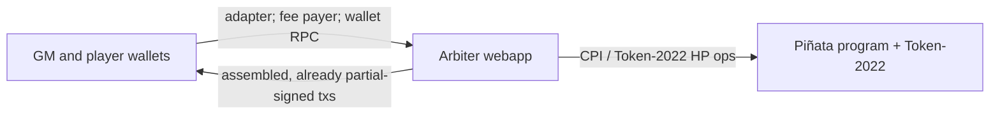

# Confidential Piñata

A Solana game: smash a **glass piñata**. Everyone can see the candy (a public token reward). Nobody can see how much HP is left.

Players pay a fixed SOL fee per strike. Each successful strike burns 1 HP and assigns the player's wallet the next zero-based index. The more a player strikes, the more indexes they hold and the higher their odds of winning. The strike that takes remaining HP to **zero** closes striking and starts the Drawing; `Settle` later pays the locked reward to the player assigned the selected index and pays the SOL pile to the game master. Several piñatas can be live at once. Each is independent.

This repository contains the **v1 design** and an in-progress implementation under `impl/`. This README is only a concept and navigation summary. Normative rules live in [docs/](docs/README.md) (**Decided** / **Still open**). If a sentence here disagrees with those files, the docs win.

**Cluster:** v1 targets a Solana test cluster with the required ZK support; it does not assume generic public devnet supports the Confidential Balances flow.

## What you would ship

Three pieces, one trusted off-chain party:

| Piece | Job |
| --- | --- |
| **Piñata program** | Five instructions: Initialize, Register, Attack, Settle, Close. Attack takes strike SOL, burns 1 HP, and assigns an index. The terminal Attack enters `Drawing`; Settle atomically pays the reward and SOL pile. |
| **Arbiter webapp** | The only client. Prices the reward, draws HP, holds confidential HP keys, attaches proofs, chooses and persists the prototype selected index and nonce, and constructs and signs Settle. Frontend + backend + program client are one participant, not a second relay. |
| **Wallets** | GM pays Initialize account rent and Close. Players pay Attack. Any participant requesting Settle pays that transaction fee. They sign what the webapp already built; they do not assemble Attack or Settle. |

HP is Token-2022 confidential balances on **one shared mint**, one token account per piñata. The arbiter’s key is the HP vault **authority**. The program does **not** PDA-sign confidential HP. The reward and SOL pile stay locked under program control through `Drawing`; Settle spends both atomically. Details: [deployment.md](docs/deployment.md).

The game master does not pick HP and must not read the arbiter backend. How that isolation is enforced is still open.

The v1 offset range, `0..=5`, is public. The realized offset, exact HP, remaining HP, and arbiter price quote stay private during play.

## Drawing and settlement, on chain

**In the game**, each paid successful strike assigns the attacking wallet the next index. When remaining HP reaches zero, striking closes with final index range `[0, N - 1]`; the terminal attacker wins only if one of their indexes is selected.

**On chain**, `ConfidentialBurn` does not say the post-burn balance is zero. A terminal Attack must include a `VerifyZeroCiphertext` bound to that vault after the burn ([program.md](docs/program.md) **D3**). A successful proof moves the instance to `Drawing` and stores the selected-index commitment; it does not pay either pot. A last-HP burn with no such proof would leave the session stuck live. That path is only a malicious or exploited arbiter ([arbiter.md](docs/arbiter.md) **A7**), and v1 trusts the arbiter not to take it (**A5**). Settle later opens the commitment and performs both payouts.

## Read the design

Catalog and ownership: [docs/README.md](docs/README.md).

| When you need | Open |
| --- | --- |
| Loop, roles, SAS identity, why HP is hidden | [game.md](docs/game.md) |
| What is encrypted vs public; HP Token-2022 path | [confidential-balances.md](docs/confidential-balances.md) |
| Who holds keys; owner vs authority; shared mint | [deployment.md](docs/deployment.md) |
| Instruction rules; Drawing and settlement | [program.md](docs/program.md) |
| Price, HP formula, proofs, prototype selection, pre-launch VRF, isolation | [arbiter.md](docs/arbiter.md) |
| Initialize / Attack / Settle sequences (wallet adapter, partial-sign, send) | [flows.md](docs/flows.md) |

Still unspecified (do not invent an answer): SAS credential and person-id field; how GM isolation is enforced; optional HP mint auditor; Initialize proof kinds; Close Token-2022 wire details; how later versions bind HP Token-2022 ops to the Piñata program; the pre-launch VRF provider, request/reveal lifecycle, state, transaction sequence, and fee funding; and whether the program must enforce the VRF-selected index-to-attacker mapping on chain.
