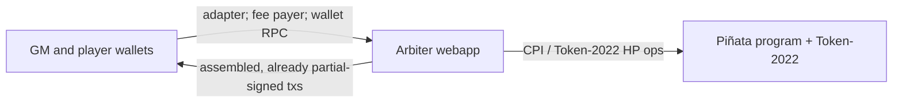

# Confidential Piñata

A Solana game: smash a **glass piñata**. Everyone can see the candy (a public token reward). Nobody can see how much HP is left.

Players pay a fixed SOL fee per strike. Each hit does 1 HP. The strike that takes leftover HP to **zero** wins the locked reward; the game master gets the SOL pile. Several piñatas can be live at once. Each is independent.

This repo is the **v1 design**, not an implementation. There is no program, client, or deployable webapp here yet. Normative rules live in [docs/](docs/README.md) (**Decided** / **Still open**). If a sentence here disagrees with those files, the docs win.

**Cluster:** Solana test network (devnet-oriented). Confidential Balances need a ZK-capable cluster.

## What you would ship

Three pieces, one trusted off-chain party:

| Piece | Job |
| --- | --- |
| **Piñata program** | Four instructions: Initialize, Register, Attack, Close. Takes strike SOL, pays on a proven kill, holds the public reward and the SOL pile. |
| **Arbiter webapp** | The only client. Prices the reward, draws HP, holds confidential HP keys, attaches proofs, partial-signs Token-2022 HP ops. Frontend + backend + program client are one participant, not a second relay. |
| **Wallets** | GM pays rent and Close. Players pay Attack. They sign what the webapp already built. They do not assemble Attack. |

HP is Token-2022 confidential balances on **one shared mint**, one token account per piñata. The arbiter’s key is the HP vault **authority**. The program does **not** PDA-sign confidential HP. Reward and SOL stay under the program. Details: [deployment.md](docs/deployment.md).

The game master does not pick HP and must not read the arbiter backend. How that isolation is enforced is still open.

## Kill, on chain vs in the game

**In the game**, zero leftover HP is the win.

**On chain**, `ConfidentialBurn` does not say leftover is zero. The program pays only if this Attack includes a `VerifyZeroCiphertext` bound to that vault after the burn ([program.md](docs/program.md) **D3**). A last-HP burn with no such proof would leave the session stuck live. That path is only a malicious or exploited arbiter ([arbiter.md](docs/arbiter.md) **A7**). v1 trusts the arbiter not to take it (**A5**).

## Read the design

Catalog and ownership: [docs/README.md](docs/README.md).

| When you need | Open |
| --- | --- |
| Loop, roles, SAS identity, why HP is hidden | [game.md](docs/game.md) |
| What is encrypted vs public; HP Token-2022 path | [confidential-balances.md](docs/confidential-balances.md) |
| Who holds keys; owner vs authority; shared mint | [deployment.md](docs/deployment.md) |
| Instruction rules; kill settlement | [program.md](docs/program.md) |
| Price, HP formula, proofs, isolation | [arbiter.md](docs/arbiter.md) |
| Initialize / Attack sequences (wallet adapter, partial-sign, send) | [flows.md](docs/flows.md) |

Still unspecified (do not invent a v1 answer): SAS credential and person-id field; how GM isolation is enforced; optional HP mint auditor; Initialize proof kinds; Close Token-2022 wire details; how later versions bind HP Token-2022 ops to the Piñata program.
