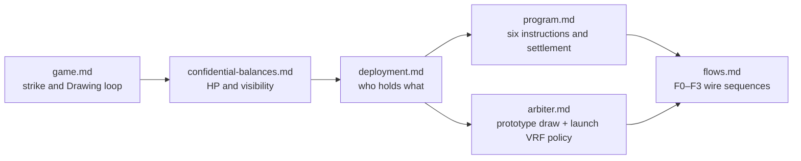

# Docs

Technical design for **Confidential Piñata**, a mystery-supply raffle. Each paid successful Attack strikes the piñata, burns 1 confidential HP, and assigns the attacking wallet the next index: 0 for the first successful strike, 1 for the second, and so on. When HP reaches zero, those indexes form the Drawing range: the more a player strikes, the more indexes they hold and the higher their odds of receiving the public reward. The Terminal Attack closes striking and records final `N`; the arbiter privately derives the prototype winner for a separate signed `Settle`, which pays that player and sends the SOL pile to the GM.

Account layouts, proof bytes, and client code are out of scope until a later pass.

v1 **Decided** and **Still open** sit in the files below, not in the project README.

## Reading order

1. [Game](game.md)
2. [Confidential balances](confidential-balances.md)
3. [Deployment](deployment.md)
4. [Program](program.md)
5. [Arbiter](arbiter.md)
6. [Flows](flows.md)

| Doc                                                  | Owns                                                                                                                      | Still open                                                                                       |
| ---------------------------------------------------- | ------------------------------------------------------------------------------------------------------------------------- | ------------------------------------------------------------------------------------------------ |
| [game.md](game.md)                                   | Mystery-supply strike and Drawing loop, player incentives, prototype wallet identity, pre-launch SAS identity, reputation | Pre-launch SAS credential / person-id field; points to winner-mapping question                   |
| [confidential-balances.md](confidential-balances.md) | HP as the hidden Drawing range length; visibility; Token-2022 HP mechanics                                                | Optional mint auditor                                                                            |
| [deployment.md](deployment.md)                       | Participants, state/escrow topology, DEP1–DEP6, owner versus authority                                                    | Later HP bind to program (**O1**; not arbiter isolation **O1**); VRF component awaits provider   |
| [program.md](program.md)                             | Six instructions—Initialize, Reinitialize, Register, Attack, Settle, Close—and D1–D4 enforcement                          | Reinitialize mechanics; instruction and account layouts; VRF-driven program changes             |
| [arbiter.md](arbiter.md)                             | Price, HP formula, public offset range, keys, proofs, stateless prototype draw, pre-launch winner VRF policy; A1–A8       | Isolation enforcement (**O1**); VRF lifecycle and index-to-attacker enforcement (**O2**)         |
| [flows.md](flows.md)                                 | F0–F3: atomic transaction-v1 wallet/send, Initialize, Attack, Settle                                                      | Reinitialize wire (**O2**); Close wire (**O3**); pre-launch VRF wire flow (**O4**)               |

## Cross-document Still open summary

- Which SAS credential/schema and person-id field must the program compare before launch? ([game.md](game.md))
- How is GM isolation from arbiter secrets enforced? ([arbiter.md](arbiter.md) **O1**)
- Which VRF or equivalent provider, request/reveal lifecycle, state fields, transaction sequence, and fee-funding model replaces prototype raffle selection before launch? ([arbiter.md](arbiter.md) **O2**, [flows.md](flows.md) **O4**)
- Must the program enforce the VRF-selected index-to-attacker mapping on-chain, or is a publicly reproducible successful-Attack-history scan with detectable arbiter dishonesty sufficient? ([arbiter.md](arbiter.md) **O2**)
- How do later versions forbid out-of-band HP Token-2022 mutations? ([deployment.md](deployment.md) **O1**)
- Which exact Reinitialize mechanics and Close wire instructions are required? ([flows.md](flows.md) **O2**, **O3**)
