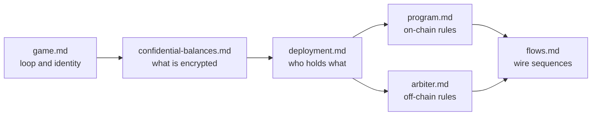

# Docs

Technical design for **Confidential Piñata**. Account layouts, proof bytes, and client code are out of scope until a later pass.

v1 **Decided** and **Still open** sit in the files below, not in the project README.

## Reading order

1. [Game](game.md)
2. [Confidential balances](confidential-balances.md)
3. [Deployment](deployment.md)
4. [Program](program.md)
5. [Arbiter](arbiter.md)
6. [Flows](flows.md)

| Doc | Owns | Still open |
| --- | --- | --- |
| [game.md](game.md) | Session loop, roles, SAS identity, reputation | SAS credential / person-id field |
| [confidential-balances.md](confidential-balances.md) | HP vs reward visibility; Token-2022 HP mechanics | Optional mint auditor |
| [deployment.md](deployment.md) | Participants, DEP1–DEP6, owner vs authority | Later HP bind to program (**O1**; not arbiter isolation **O1**) |
| [program.md](program.md) | Initialize, Register, Attack, Close; D1–D4 | Instruction layouts |
| [arbiter.md](arbiter.md) | Price, HP formula, keys, proofs; A1–A8 | Isolation enforcement (**O1**) |
| [flows.md](flows.md) | F0–F2 sequences | Initialize proofs (**O1**); Close wire (**O2**) |

Back to the [project README](../README.md).
