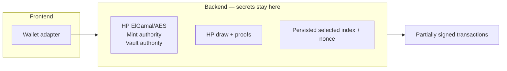
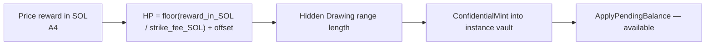
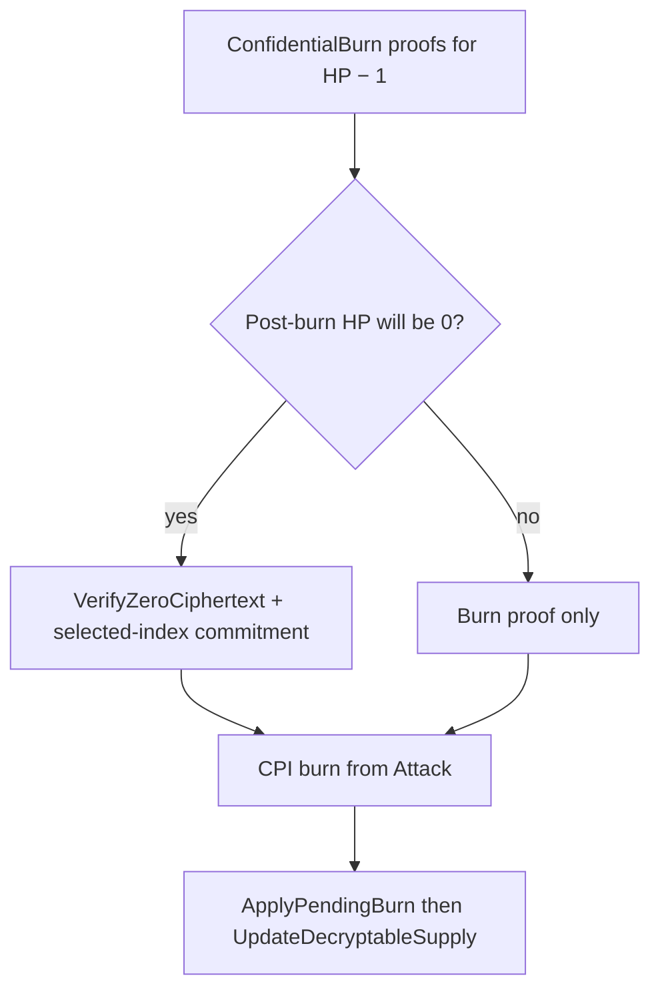

# Arbiter

Off-chain webapp: prices the reward, draws HP, holds keys, attaches confidential HP proofs, performs the prototype raffle selection, and constructs and signs `Settle`.

The **arbiter webapp is the arbiter**. v1 does not add a second process (**DEP2**).

Deployment: [deployment.md](deployment.md). On-chain: [program.md](program.md). Sequences: [flows.md](flows.md).

RPC shapes and host configuration besides key storage (**A2**) are unspecified here.

## Decided

Normative language follows RFC 2119.

### A1. Topology

The v1 arbiter MUST be the arbiter webapp (frontend, backend, and Piñata program client as one participant), not a second extra process. That webapp is the primary client for GM and player wallets (**DEP4**).

| Flow | Arbiter MUST |
| --- | --- |
| Attack | Participate in every Attack that mutates confidential HP: attach proofs and sign as vault authority. For the Terminal Attack, also choose and persist the selected index and nonce and supply the commitment. Not player-only. |
| Settle | Reuse the persisted prototype result, scan successful Attack history to find the player assigned the selected index, construct Settle, and sign as configured arbiter authority. Never reroll because a requester refuses to sign. |
| Close | Construct Close, including leftover-zero proof and vault-authority signature. Not GM-only-assembled. |
| Keys | HP ElGamal and AES (vault and supply), HP mint authority, HP vault authority, and prototype draw secrets live in the **backend** (**DEP2**, **DEP5**, **DEP6**). |

### A2. Keys and HP plaintext

These MUST live only in the backend:

| Secret | Scope |
| --- | --- |
| HP ElGamal keypair | Encrypts every instance HP vault **and** the shared mint's confidential supply. Token-2022 still has two slots (account vs mint); v1 MUST configure both with this same ElGamal pubkey. **Derived** at runtime from the arbiter Solana authority keypair (ZK SDK / Token-2022 signer derivation). **Reused** across instances and sessions. MUST NOT be generated per instance. MUST NOT be a separate env secret. |
| HP AES key | Decryptable available balance on every instance vault **and** decryptable supply on the mint. **Derived** from the same authority keypair (SDK domain-separated from ElGamal). v1 MUST use that one AES for both slots. **Reused.** MUST NOT be generated per instance. MUST NOT be a separate env secret. |
| HP mint authority | Token-2022 mint signer. **Reused.** Stored in env. |
| HP vault authority | Token-2022 signer for each instance's HP token account. **Reused.** MAY be the same keypair as mint authority. Simplest v1: that env keypair is both. |
| HP draw and proof generation | Plaintext HP and remaining HP. |
| Prototype raffle opening | Once selected: final `N`, selected index, and fresh secret nonce. Persisted through settlement. |

The arbiter MUST reuse the HP key material for every instance and Initialize, including a later session on the same piñata. HP vaults remain per-instance accounts; the keys are not. The instance HP vault MUST be a PDA **address**; that is not custody of these keys.

v1 MUST store only the arbiter Solana authority keypair in an env file that exists only on the arbiter host and is readable by the arbiter backend. HP ElGamal and AES MUST be derived from that keypair on the fly. The derivation public seed MUST be a fixed implementation constant, not an instance vault address, so vault and supply share one ElGamal. They MUST NOT be in the frontend, in git, in a PDA, or on the GM workstation. That is custody and access for the server. It is not isolation enforcement (**O1**): a game master with host access can still read the file.

### A3. Initialize: price, offset, mint

At Initialize the arbiter MUST:

1. Price the locked public reward in SOL (**A4**).
2. Draw an integer offset from the public v1 range `0..=5` and set `HP = floor(reward_in_SOL / strike_fee_SOL) + offset`.
3. Treat that initial HP as the successful-strike count at which play closes and as the eventual length of the Drawing range.
4. Confidential-mint that HP into the instance HP vault on the shared HP mint so public deposit amounts and public mint supply do not reveal HP. Initialize MUST CPI `ConfidentialMint`, which credits **pending**, and then MUST CPI `ApplyPendingBalance` immediately so minted HP is **available** ([flows.md](flows.md) **F1**). Both operations are atomic inside Initialize. The arbiter MUST partial-sign Initialize; its signer privilege is forwarded to the CPIs as HP mint authority and HP vault authority (**DEP5**, **DEP6**). v1 MUST NOT PDA-sign either confidential operation.

The offset range and maximum MUST be public; the current prototype range is `0..=5`. Only the realized offset remains secret during play. Resulting HP MUST be at least 1; Initialize MUST fail otherwise. The game master MUST NOT choose HP. The public range lets participants estimate the possible final strike-count range and lets the GM gauge maximum potential proceeds, but the arbiter's exact quote, realized offset, exact HP, and remaining HP stay private during play.

### A4. Jupiter price

Source: [verified.jup.ag/apis](https://verified.jup.ag/apis) — `GET https://api.jup.ag/tokens/v2/search?query=<mint>`.

Read `usdPrice` for the reward mint and for wrapped SOL (`So11111111111111111111111111111111111111112`).

`reward_in_SOL = (reward_ui_amount × reward_usdPrice) / sol_usdPrice`

If the mint is absent from the response or `usdPrice` is null, the arbiter MUST treat **1 token = 1 USD** and MUST still convert USD to SOL using Jupiter's SOL `usdPrice`.

Participants MAY estimate an HP and final strike-count range from public Jupiter quotes, the fixed strike fee, and public offset range. They MUST NOT be assumed to know the arbiter's exact quote or realized offset. Those values and the HP draw are trusted to the arbiter in v1.

### A5. Attack proofs

| Step | Arbiter MUST |
| --- | --- |
| Burn | Attach Token-2022 proofs for homomorphic −1 on the HP vault. Partial-sign as **vault** authority (**DEP6**). Attack MUST CPI that burn (**D3**). MUST NOT PDA-sign it. |
| Supply | Immediately after: `ApplyPendingBurn` then `UpdateDecryptableSupply`. Partial-sign both as **mint** authority (**DEP5**). These fold / refresh **shared-mint** supply. They are **not** the HP decrement. |
| Normal Attack | If post-burn HP is nonzero, attach only the burn proofs. The attacking wallet receives the next chronological successful-Attack index and the instance remains `Live`. |
| Terminal Attack | If post-burn HP is zero, attach `VerifyZeroCiphertext` for the post-burn vault `available_balance`, choose and persist the prototype selected index and nonce as described below, and supply their commitment. MUST NOT assemble a terminal burn without the zero proof or commitment. |
| Payout | MUST NOT transfer reward or pile during Attack. Payout occurs only through `Settle`. |
| Isolation | MUST NOT expose per-strike refusal to the GM. MUST NOT reveal exact HP, remaining HP, the realized offset, exact price quote, selected index, or nonce during play. The offset range `0..=5` is public. |

A normal wallet signs the arbiter's already-partial-signed bytes and cannot omit the terminal proof by accident. Only a **malicious or exploited arbiter** can produce a last-HP burn with a valid signature set and no zero proof. That is a deliberately accepted trust assumption, in the same class as exclusive key custody (**A2**).

### Prototype raffle selection

The prototype does **not** use VRF and MUST NOT be described as trustless or verifiable randomness.

After determining that an Attack will reduce HP to zero, the arbiter MUST:

1. Calculate final successful-Attack count `N`, which equals the Terminal Attack's index plus one and, absent out-of-band HP mutation, realized initial HP.
2. Uniformly choose one index from the final Drawing range `[0, N - 1]` exactly once.
3. Generate a fresh secret nonce, persist `N`, the selected index, and nonce before returning the Terminal Attack, and never reroll them.
4. Construct a hiding and binding commitment over the session, `N`, selected index, and nonce. The nonce is required because the index domain is small.
5. Put only that commitment in the Terminal Attack. The selected index and nonce MUST NOT be visible.

For `Settle`, the arbiter MUST reuse the persisted selected index and nonce, scan the public chronological successful-Attack history to find the wallet assigned that index, construct the transaction with that player as reward recipient, reveal the index and nonce, and sign as configured arbiter authority. The program verifies the opening and range; it does not scan historical transactions. Prototype v1 trusts the arbiter both for randomness quality and the ledger-derived index-to-wallet mapping. The selected index and resulting payout become publicly auditable at settlement.

If a requester sees the result and refuses to sign, subsequent requesters MUST receive the same persisted opening and reward recipient. Refusal can delay settlement but cannot cause a reroll.

Exact commitment bytes, hash choice, field sizes, and account layout are instruction-layout details (**D3**).

### A6. Game master isolation

The GM MUST NOT read the backend: no HP ElGamal or AES keys, HP mint authority, HP vault authority, HP draw, remaining HP, realized offset, selected index or nonce before settlement, or per-strike refusal. Using the frontend to sign Initialize or Close does not count as reading the arbiter (**DEP3**). This is policy. Enforcement is **O1**. If isolation fails, the house knows exact HP and may learn or influence the prototype selection.

### A7. Liveness versus censorship

| Stall | Meaning |
| --- | --- |
| Full stall | Process down. Session liveness **is** arbiter uptime. |
| Attack censorship | Refuse to prove or sign selected players' Attacks. Isolation (**A6**) is intended to prevent GM-directed selective censorship. |
| Settlement censorship | Refuse to build or sign `Settle`, or a requester refuses to countersign after seeing the result. Funds remain escrowed in `Drawing`. Another requester can overcome requester refusal, but not arbiter refusal. |

Attack is **vulnerable on chain**: the ZK ElGamal Proof Program does not document a leftover-nonzero / zero-exclusive-range instruction (`VerifyBatchedRangeProofU*` is `[0, 2ⁿ)`, which includes 0). The program therefore cannot reject a last-HP `ConfidentialBurn` that omits `VerifyZeroCiphertext`. If a malicious or exploited arbiter submits that Attack, **D3** keeps the session `Live`: leftover encrypt(0), no `Drawing`, and further burns fail. `Settle`, Initialize, and Close remain unavailable.

That is not a player vector: Attack is arbiter-assembled and already partial-signed (**F0**); a custom signer cannot rebuild it from an unsigned payload. Shifting a range to exclude 0 would be a homemade proof and is out of scope. v1 MUST NOT add that live-path check. A failed or mismatched `VerifyZeroCiphertext` aborts the entire Attack (**D3**). `Settle` later relies on `Drawing` and does not repeat the zero proof.

> **FUTURE (not v1).** Omitting the zero proof is not the only arbiter HP bypass. Mint and vault authority also let the arbiter mint/burn/apply/close HP by calling Token-2022 with no Piñata instruction. v1 allows that to reduce the number of Piñata instructions during early development. Later versions MUST forbid out-of-band HP modification ([deployment.md](deployment.md) **DEP6**, **O1** — not this file's **O1**).

### A8. Pre-launch randomness requirements

Before product launch, raffle-winner selection MUST replace prototype selection with VRF or equivalent publicly verifiable, unpredictable randomness. The result MUST NOT be available early enough for the arbiter, GM, or Terminal Attacker to manipulate strike participation.

The exact provider, request/reveal lifecycle, state fields, transaction sequence, and fee funding remain open (**O2**). The prototype selected-index commitment MUST NOT be assumed to be the final architecture: an asynchronous VRF may instead require committing a randomness request when striking closes.

Winner-selection VRF is distinct from HP-offset randomness. Using VRF for the HP offset remains deferred and is not part of the mandatory winner-selection replacement.

Restricting HP Token-2022 mutations to the Piñata program is also later, not v1 ([deployment.md](deployment.md) **DEP6** FUTURE, **O1**).

## Still open

### O1. Isolation enforcement

How **A6** is enforced is unspecified. Software policy on a game-master-hosted host is insufficient if they have root. TEE, third-party operator, or equivalent is not chosen.

### O2. Pre-launch winner randomness and mapping

The VRF provider, request/reveal lifecycle, state fields, transaction sequence, and fee funding are undecided. The design MUST answer this non-trivial launch ambiguity before choosing any additional participation storage or claim mechanism:

> Must the program enforce the VRF-selected index-to-attacker mapping on-chain, or is a publicly reproducible successful-Attack-history scan with detectable arbiter dishonesty sufficient?

No Merkle tree, per-strike PDA, NFT, account array, or claim mechanism is decided. VRF for the HP offset remains a separate deferred question.
