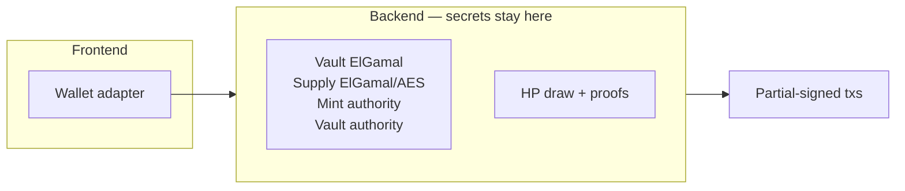
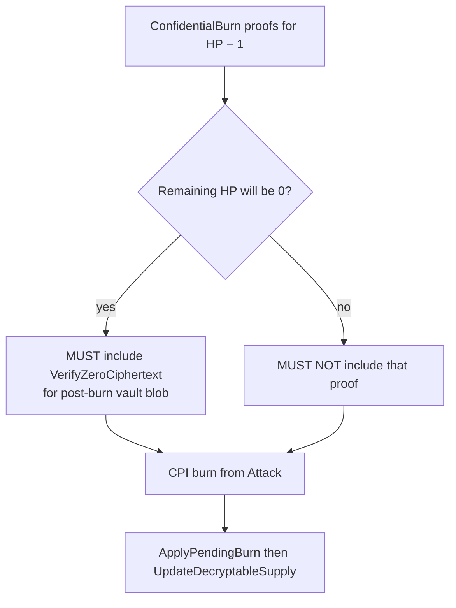

# Arbiter

Off-chain webapp: prices the reward, draws HP, holds keys, attaches confidential HP proofs, hosts the Piñata program client.

The **arbiter webapp is the arbiter**. v1 does not add a second process (**DEP2**).

Deployment: [deployment.md](deployment.md). On-chain: [program.md](program.md). Sequences: [flows.md](flows.md).

RPC shapes, key-storage formats, and host configuration are unspecified here.

## Decided

Normative language follows RFC 2119.

### A1. Topology

The v1 arbiter MUST be the arbiter webapp (frontend, backend, and Piñata program client as one participant), not a second extra process. That webapp is the primary client for GM and player wallets (**DEP4**).

| Flow | Arbiter MUST |
| --- | --- |
| Attack | Participate in every Attack that mutates confidential HP (proofs **plus** vault-authority signature). Not player-only. |
| Close | Construct Close, including leftover-zero proof and vault-authority signature. Not GM-only-assembled. |
| Keys | Vault ElGamal, HP mint supply keys, HP mint authority, and HP vault authority live in the **backend** (**DEP2**, **DEP5**, **DEP6**). |

### A2. Keys and HP plaintext

These MUST live only in the backend:

| Secret | Scope |
| --- | --- |
| HP vault ElGamal keys | Account encryption for **that instance’s** HP vault (one token account per instance) |
| HP mint **supply** ElGamal keypair and supply AES | Shared mint `ConfidentialMintBurn` encrypted / decryptable supply. Distinct from vault keys. One set for the mint. |
| HP mint authority | Token-2022 mint signer |
| HP vault authority | Token-2022 signer for that instance’s HP token account. MAY be the same keypair as mint authority. |
| HP draw and proof generation | Plaintext HP |

A PDA MUST NOT hold those secrets. After Initialize, those live keys MUST NOT remain on the GM workstation or in the frontend. The instance HP vault MAY be a PDA **address**; that is not custody of these keys.

### A3. Initialize: price, offset, mint

At Initialize the arbiter MUST:

1. Price the locked public reward in SOL (**A4**).
2. Set \(\mathrm{HP} = \lfloor \mathrm{reward\_in\_SOL} / \mathrm{strike\_fee\_SOL} \rfloor + \mathrm{offset}\).
3. Confidential-mint that HP into the instance HP vault on the shared HP mint (`ConfidentialMint`, CPI during Initialize) so public deposit amounts and public mint supply do not reveal HP. `ConfidentialMint` credits **pending**. The Initialize transaction MUST `ApplyPendingBalance` immediately after so minted HP is **available** ([flows.md](flows.md) **F1**). The arbiter MUST partial-sign that apply as HP vault authority (**DEP6**). v1 MUST NOT PDA-sign it.

`offset` MUST be an integer \(\geq 0\) (zero is allowed). The closed interval from which `offset` is drawn MUST be known only to the arbiter. Resulting HP MUST be at least 1; Initialize MUST fail otherwise. The game master MUST NOT choose HP.

### A4. Jupiter price

Source: [verified.jup.ag/apis](https://verified.jup.ag/apis) — `GET https://api.jup.ag/tokens/v2/search?query=<mint>`.

Read `usdPrice` for the reward mint and for wrapped SOL (`So11111111111111111111111111111111111111112`).

\[
\mathrm{reward\_in\_SOL} = (\mathrm{reward\_ui\_amount} \times \mathrm{reward\_usdPrice}) / \mathrm{sol\_usdPrice}
\]

If the mint is absent from the response or `usdPrice` is null, the arbiter MUST treat **1 token = 1 USD** and MUST still convert USD to SOL using Jupiter’s SOL `usdPrice`.

Participants MAY estimate a floor from public Jupiter quotes. They MUST NOT be assumed to know the arbiter’s quote. Price, offset range, and the draw are trusted to the arbiter in v1.

### A5. Attack proofs

| Step | Arbiter MUST |
| --- | --- |
| Burn | Attach Token-2022 proofs for homomorphic −1 on the HP vault. Partial-sign as **vault** authority (**DEP6**). Attack MUST CPI that burn (**D3**). MUST NOT PDA-sign it. |
| Supply | Immediately after: `ApplyPendingBurn` then `UpdateDecryptableSupply`. Partial-sign both as **mint** authority (**DEP5**). These fold / refresh **shared-mint** supply. They are **not** the HP decrement. |
| Kill proof | If leftover HP is 0: `VerifyZeroCiphertext` for the **post-burn** vault `available_balance` (the ciphertext Token-2022 will write — homomorphic leftover — not a fresh `Encrypt(0)`). MUST NOT assemble last-HP burn without that proof. If leftover will not be 0: MUST NOT include that proof. On-chain presence vs absence: **D3**. |
| Reward | Public token transfer on a kill. No confidential reward proofs. |
| Isolation | MUST NOT expose per-strike refusal to the GM. MUST NOT reveal HP draw, `offset`, or offset range while live. |

A normal wallet signs the arbiter’s already-partial-signed bytes and cannot omit the kill proof by accident (signed-message integrity). Only a **malicious or exploited arbiter** can produce a last-HP burn with a valid signature set and no zero-proof. That is a deliberately accepted trust assumption, same class as exclusive key custody (**A2**). The arbiter is assumed trustworthy and secure.

### A6. Game master isolation

The GM MUST NOT read the backend: no vault keys, no supply ElGamal or AES keys, no HP mint authority, no HP vault authority, no HP draw, no per-strike refuse. Using the frontend to sign Initialize or Close does not count as reading the arbiter (**DEP3**). This is policy. Enforcement is **O1**. If isolation fails, the house knows exact HP and can select a winner.

### A7. Liveness versus censorship

| Stall | Meaning |
| --- | --- |
| Full stall | Process down. Session liveness **is** arbiter uptime. |
| Selective censorship | Prove only a friend’s Attack. Isolation (**A6**) is intended to allow only the former. |

Attack is **vulnerable on chain**: the ZK ElGamal Proof Program does not document a leftover-nonzero / zero-exclusive-range instruction (`VerifyBatchedRangeProofU*` is `[0, 2ⁿ)`, which **includes 0**). The program therefore cannot reject a last-HP `ConfidentialBurn` that omits `VerifyZeroCiphertext`. If a **malicious or exploited arbiter** submitted that Attack, **D3** would keep the session live: leftover encrypt(0), no settlement, further burns fail (**D4** Close still waits on game-over).

That is not a player vector: Attack is arbiter-assembled and already partial-signed (**F0**); a custom signer cannot rebuild it from an unsigned payload. Shifting a range to exclude 0 would be a homemade proof and is out of scope. v1 MUST NOT add that live-path check.

The **arbiter implementation MUST NOT take that path** (**A5**). Last-HP burn without a zero-proof is not a permitted arbiter behavior; exercising it is the accepted malicious-arbiter trust assumption, not an unclosed player grief.

A failed `VerifyZeroCiphertext` CPI MUST NOT be treated as a live signal; it aborts the Attack (**D3**).

### A8. Deferred (not v1)

A VRF for the HP offset is out of scope for v1.

## Still open

### O1. Isolation enforcement

How **A6** is enforced is unspecified. Software policy on a game-master-hosted host is insufficient if they have root. TEE, third-party operator, or equivalent is not chosen.
