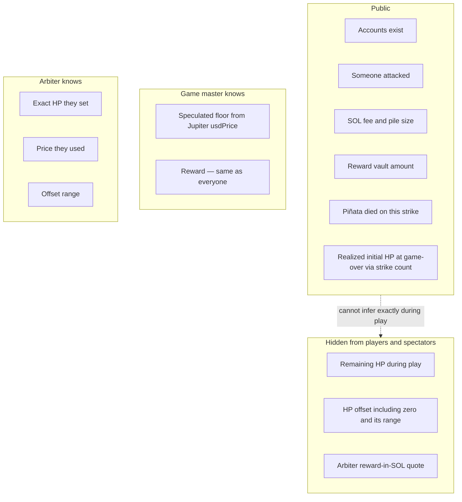

# Confidential balances

Version 1 uses Token-2022 **Confidential Balances** for **HP only**. The reward is a public token balance (a glass piñata: you see the candy, not the remaining HP).

## Two token types

- **HP token** — 1 token = 1 HP. One **shared** HP mint for all instances ([deployment.md](deployment.md) **DEP6**). Each piñata has its own HP token account (not an ATA of the arbiter). That account’s confidential balance *is* that piñata’s health. Initial HP is confidential-minted so a public deposit or public supply cannot leak the draw.
- **Reward token** — any public token mint; conceptually a stablecoin. Locked at Initialize; the vault amount is visible; only the killing player receives it.

**Register** exists so each player can set up a token account for the reward mint before a payout can land.

## What observers can see

HP is hidden from **players and spectators** during play. The reward is not. The game master does not know exact HP. They may guess a break-even floor from public prices; the arbiter’s quote and the offset (including 0) are secret.

Zero remaining HP is not a public field. Token-2022 `ConfidentialBurn` does not attest leftover HP is zero. A killing Attack includes `VerifyZeroCiphertext` (ZK ElGamal Proof Program); the Piñata program binds that proof to this vault’s post-burn `available_balance` ([program.md](program.md) **D3**). Observers learn the piñata died on this strike. An Attack with no such proof stays live even if leftover HP is actually zero: that is an instruction gap reachable only by a malicious or exploited arbiter ([arbiter.md](arbiter.md) **A7**); the arbiter is assumed trustworthy and MUST NOT assemble it ([arbiter.md](arbiter.md) **A5**).

The proof program has no documented leftover-nonzero instruction. Its range proofs certify `[0, 2ⁿ)` (zero included). v1 does not compose a shifted range to exclude 0.

They cannot infer **remaining** HP during play (they do not know the arbiter’s price or the offset). At game-over, public strike count **is** realized initial HP. “Prior remaining HP” on the killing strike is 1 — that follows from 1 HP per hit, not from decrypting the ciphertext.

## Network

Version 1 targets a test network. Confidential Balances need a ZK-capable cluster, which may not be generic public devnet.

## Decided

- Two token types: **HP** (confidential; 1 token = 1 HP; one shared mint; one token account per instance) and **reward** (public token; conceptually a stablecoin). Confidential Balances apply to HP only. HP vault **owner** is Token-2022; HP vault **authority** is the arbiter; the vault **address** is an instance PDA ([deployment.md](deployment.md) **DEP6**).
- Initial HP is confidential-minted so public deposit / public mint supply cannot leak the draw. Token-2022 `ConfidentialMint` requires the HP mint authority as a signer (arbiter backend; [deployment.md](deployment.md) **DEP5**) and credits this instance vault’s **pending** balance. The Initialize transaction MUST `ApplyPendingBalance` immediately after (HP vault authority: arbiter; no PDA signer) so minted HP is **available**. Token-2022 `ConfidentialBurn` (Attack HP − 1) is a CPI from Attack, signed by HP vault authority plus burn proofs, **not** mint authority and **not** a PDA. `ApplyPendingBurn` requires mint authority and only folds the shared mint’s `pending_burn` into encrypted supply. `UpdateDecryptableSupply` requires mint authority and the arbiter-held supply AES key; it refreshes decryptable supply after `ApplyPendingBurn`. The HP mint’s supply ElGamal keypair and supply AES key MUST live on the arbiter backend, distinct from per-instance vault ElGamal keys ([arbiter.md](arbiter.md) **A2**).
- Zero remaining HP is attested only when an Attack includes `VerifyZeroCiphertext` bound to the post-burn HP vault ([program.md](program.md) **D3**). `ConfidentialBurn` alone is not a kill. The proof program does not document a leftover-nonzero / zero-exclusive range proof; v1 does not roll one. That instruction gap is only a malicious or exploited arbiter ([arbiter.md](arbiter.md) **A7**); the arbiter is assumed trustworthy.
- Exact HP, the offset, and the offset range are **never published**. At game-over, strike count **is** realized initial HP

## Still open

- Optional **third-party auditor** keys (debugging / compliance; rotation later). An auditor on the **shared** HP mint can see every confidential mint amount, so they can learn exact HP per Initialize. No extra v1 gameplay rules for that
