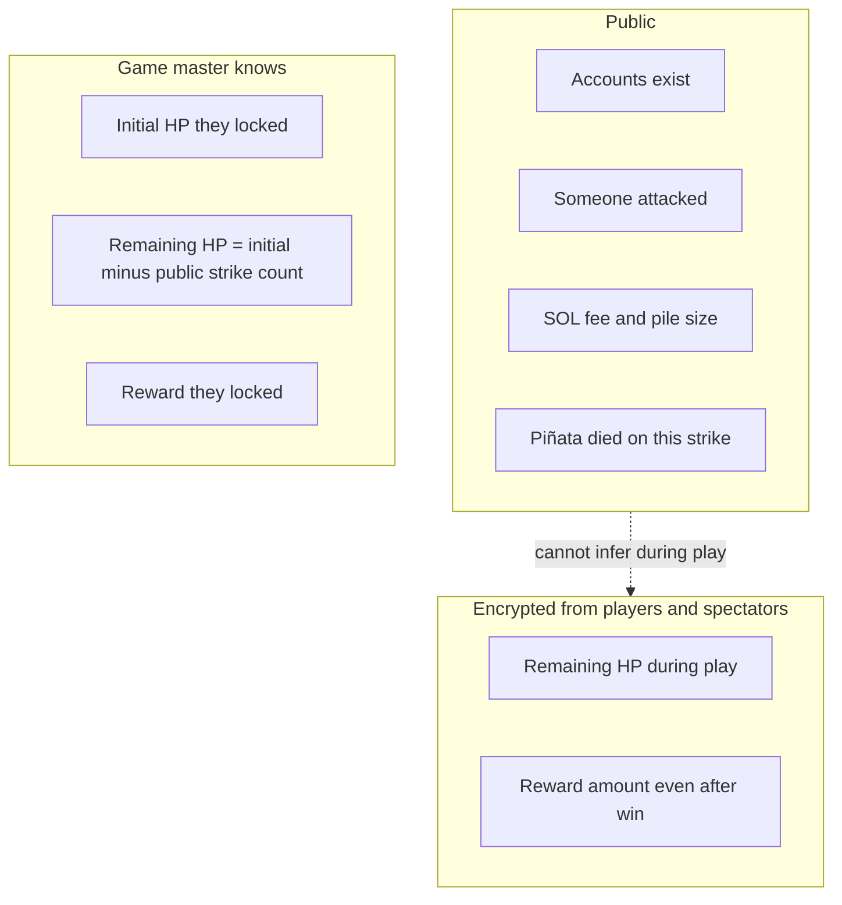

# Confidential balances

Version 1 uses Token-2022 **Confidential Balances** so HP and reward amounts stay encrypted on-chain.

## Two mints

- **HP token** — 1 token = 1 HP. The piñata’s confidential HP balance *is* its health.
- **Reward token** — any confidential-balance mint; conceptually a stablecoin. Locked at Initialize; only the killing player receives it.

**Register** exists so each player can set up a confidential-enabled token account for the reward mint before a payout can land.

## What observers can see

Hidden means hidden from **players and spectators**. The game master already knows the plaintext amounts they locked.

Zero remaining HP is not a public field. The **ElGamal proof program** attests that the remaining HP ciphertext encrypts zero. Observers learn the piñata died on this strike.

They cannot infer **remaining** HP during play (they do not know initial HP). At game-over, public strike count **is** initial HP. “Prior remaining HP” on the killing strike is 1 — that follows from 1 HP per hit, not from decrypting the ciphertext.

## Network

Version 1 targets a test network. Confidential Balances need a ZK-capable cluster, which may not be generic public devnet.
