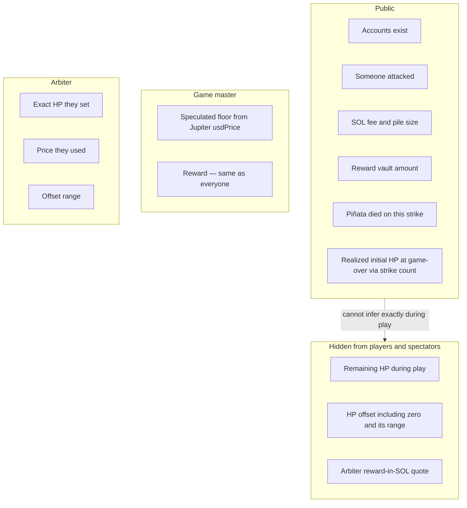
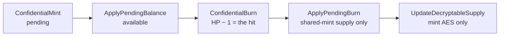
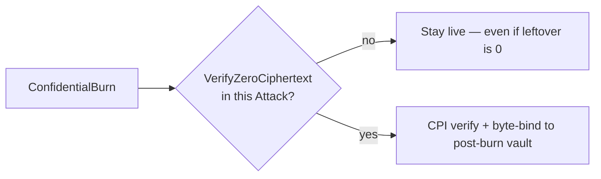

# Confidential balances

Token-2022 **Confidential Balances** apply to **HP only**. The reward is a public token balance.

Network: v1 targets a **test** cluster. Confidential Balances need ZK support, which may not be generic public devnet.

On-chain kill check: [program.md](program.md) **D3**. Who signs HP ops: [deployment.md](deployment.md) **DEP5**, **DEP6**.

## Token types

| | HP | Reward |
| --- | --- | --- |
| Kind | Confidential Token-2022 | Public token (conceptually a stablecoin) |
| Unit | 1 token = 1 HP | Any mint; vault amount is visible |
| Mint | **One shared mint** for all instances (**DEP6**) | The GM’s chosen mint |
| Per instance | Own HP **token account** (not an ATA of the arbiter) | Reward vault (program PDA) |
| What it is | That account’s confidential balance **is** that piñata’s health | The prize; only the killing player receives it |

**Register** exists so each player can set up a token account for the reward mint before a payout can land.

HP vault **address** = instance PDA. Runtime **owner** = Token-2022. **Authority** = arbiter. See **DEP6**. v1: the arbiter can also mutate that vault by calling Token-2022 with no Piñata instruction. Later versions MUST forbid that ([deployment.md](deployment.md) **FUTURE** note, **O1**).

## Who sees what

| During play | At game-over |
| --- | --- |
| Remaining HP cannot be inferred (arbiter quote and offset are secret). | Strike count **is** realized initial HP **if** HP changed only via conforming Attacks. |
| Zero leftover HP is **not** a public field. | “Prior remaining HP” on the killing strike is **1** — from 1 HP per hit, not from decrypting the ciphertext. |

Exact HP, the offset, and the offset range are **never published**.

## HP Token-2022 path

Initial HP is confidential-minted so a public deposit or public mint supply cannot leak the draw.

| Instruction | Effect | Signer |
| --- | --- | --- |
| `ConfidentialMint` | Encrypted HP into this vault’s **pending**. CPI during Initialize. | HP **mint** authority (arbiter backend) |
| `ApplyPendingBalance` | Pending → **available**. MUST follow mint immediately. Required before any Attack burn. | HP **vault** authority (arbiter; not a PDA) |
| `ConfidentialBurn` | Homomorphic −1 on this vault. **This is the hit.** CPI from Attack. | Vault authority + burn proofs (not mint authority, not a PDA) |
| `ApplyPendingBurn` | Folds the shared mint’s `pending_burn` into encrypted supply. **Not** the HP decrement. | Mint authority |
| `UpdateDecryptableSupply` | Refreshes mint AES decryptable supply after `ApplyPendingBurn`. **Not** the HP decrement. | Mint authority + arbiter-held supply AES |

Supply ElGamal and AES live on the arbiter backend. They MUST be the same ElGamal pubkey and the same AES as every instance vault, derived from the arbiter Solana authority keypair (**A2**).

## Zero leftover HP

`ConfidentialBurn` does **not** attest leftover HP is zero. Homomorphic leftover-zero is not identity bytes.

- A killing Attack includes `VerifyZeroCiphertext` (ZK ElGamal Proof Program). The Piñata program binds it to this vault’s post-burn `available_balance` (**D3**). Observers learn the piñata **died on this strike**.
- No such proof → stay live even if leftover is actually 0. That gap is **malicious/exploited arbiter only** (**A7**). Conforming arbiter MUST NOT assemble it (**A5**).
- The proof program has no leftover-nonzero / zero-exclusive-range instruction. `VerifyBatchedRangeProofU*` is `[0, 2ⁿ)` (zero included). v1 does **not** compose a shifted range to exclude 0.

## Decided

- Two token types: **HP** (confidential; 1 token = 1 HP; one shared mint; one token account per instance) and **reward** (public token; conceptually a stablecoin). Confidential Balances apply to HP only. HP vault **owner** is Token-2022; HP vault **authority** is the arbiter; the vault **address** is an instance PDA ([deployment.md](deployment.md) **DEP6**). v1 accepts arbiter out-of-band HP Token-2022 calls; later versions MUST NOT ([deployment.md](deployment.md) **FUTURE** note).
- Initial HP is confidential-minted so public deposit / public mint supply cannot leak the draw. Token-2022 `ConfidentialMint` requires the HP mint authority as a signer (arbiter backend; **DEP5**) and credits this instance vault’s **pending** balance. The Initialize transaction MUST `ApplyPendingBalance` immediately after (HP vault authority: arbiter; no PDA signer) so minted HP is **available**. Token-2022 `ConfidentialBurn` (Attack HP − 1) is a CPI from Attack, signed by HP vault authority plus burn proofs, **not** mint authority and **not** a PDA. `ApplyPendingBurn` requires mint authority and only folds the shared mint’s `pending_burn` into encrypted supply. `UpdateDecryptableSupply` requires mint authority and the arbiter-held supply AES key; it refreshes decryptable supply after `ApplyPendingBurn`. The HP mint’s supply ElGamal keypair and supply AES key MUST live on the arbiter backend, derived from the arbiter Solana authority keypair. v1 MUST use the same ElGamal pubkey and the same AES for mint supply and every instance vault (**A2**). ElGamal and AES MUST be reused across instances and sessions; they MUST NOT be generated per instance; they MUST NOT be stored as separate env values.
- Zero remaining HP is attested only when an Attack includes `VerifyZeroCiphertext` bound to the post-burn HP vault (**D3**). `ConfidentialBurn` alone is not a kill. The proof program does not document a leftover-nonzero / zero-exclusive range proof; v1 does not roll one. That instruction gap is only a malicious or exploited arbiter (**A7**); the arbiter is assumed trustworthy.
- Exact HP, the offset, and the offset range are **never published**. At game-over, strike count **is** realized initial HP if HP changed only via conforming Attacks. Out-of-band HP mutation ([deployment.md](deployment.md) **DEP6** FUTURE) breaks that.

## Still open

- Optional **third-party auditor** keys (debugging / compliance; rotation later). An auditor on the **shared** HP mint can see every confidential mint amount, so they can learn exact HP per Initialize. No extra v1 gameplay rules for that.
