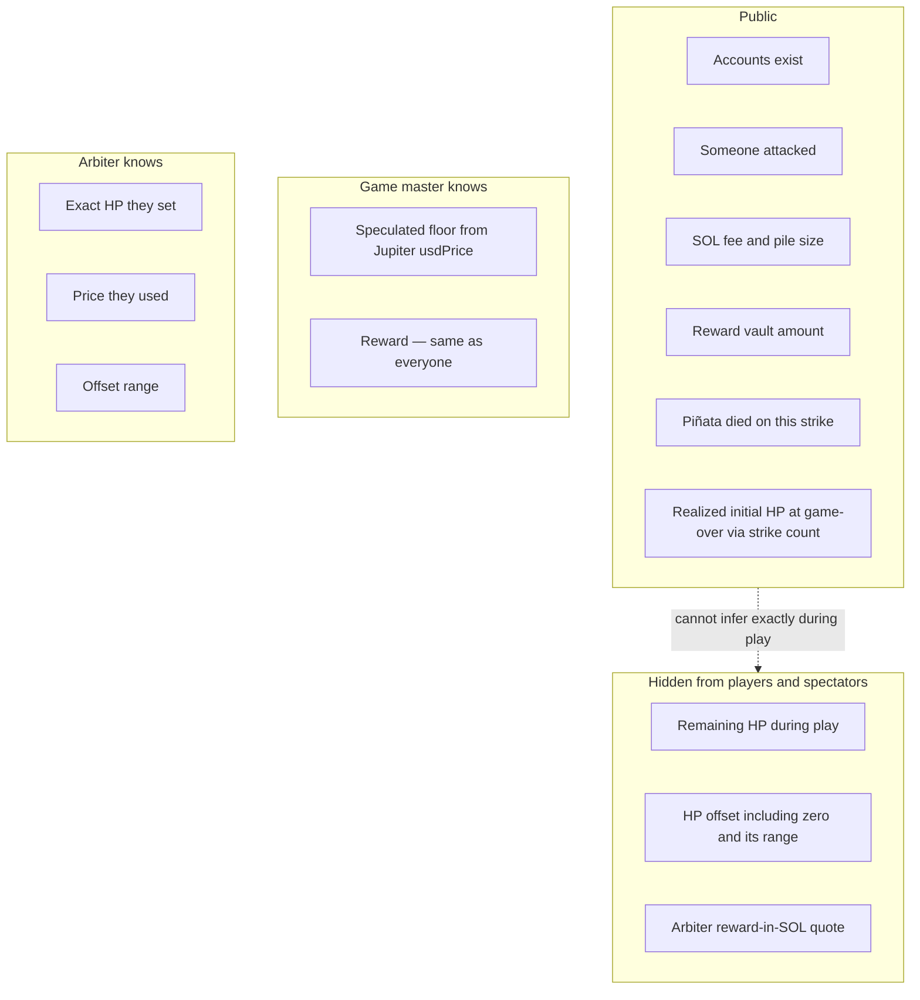

# Confidential balances

Version 1 uses Token-2022 **Confidential Balances** for **HP only**. The reward is a public token balance (a glass piñata: you see the candy, not the remaining HP).

## Two mints

- **HP token** — 1 token = 1 HP. The piñata’s confidential HP balance *is* its health. Initial HP is confidential-minted so a public deposit or public supply cannot leak the draw.
- **Reward token** — any public token mint; conceptually a stablecoin. Locked at Initialize; the vault amount is visible; only the killing player receives it.

**Register** exists so each player can set up a token account for the reward mint before a payout can land.

## What observers can see

HP is hidden from **players and spectators** during play. The reward is not. The game master does not know exact HP. They may guess a break-even floor from public prices; the arbiter’s quote and the offset (including 0) are secret.

Zero remaining HP is not a public field. The **ElGamal proof program** attests that the remaining HP ciphertext encrypts zero. Observers learn the piñata died on this strike.

They cannot infer **remaining** HP during play (they do not know the arbiter’s price or the offset). At game-over, public strike count **is** realized initial HP. “Prior remaining HP” on the killing strike is 1 — that follows from 1 HP per hit, not from decrypting the ciphertext.

## Network

Version 1 targets a test network. Confidential Balances need a ZK-capable cluster, which may not be generic public devnet.

## Decided

- Two token types: **HP** (confidential; 1 token = 1 HP) and **reward** (public token; conceptually a stablecoin). Confidential Balances apply to HP only
- Initial HP is confidential-minted so public deposit / public mint supply cannot leak the draw
- Zero remaining HP is attested by the **ElGamal proof program** (no public HP number)
- Exact HP, the offset, and the offset range are **never published**. At game-over, strike count **is** realized initial HP

## Still open

- Optional **third-party auditor** keys (debugging / compliance; rotation later). An auditor on the HP mint can see the confidential mint amount, so they can learn exact HP. No extra v1 gameplay rules for that
