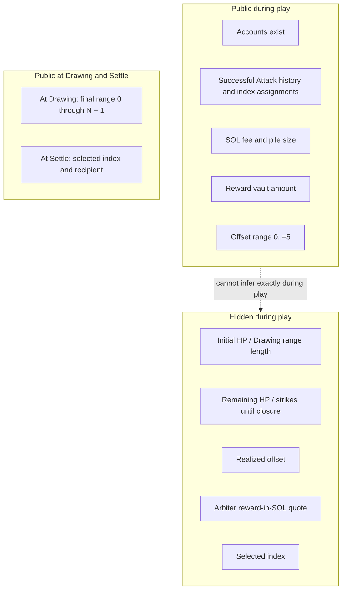
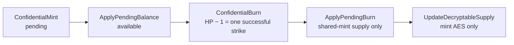
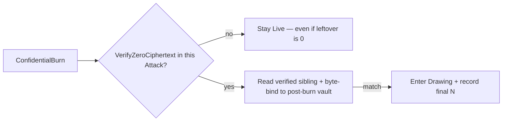

# Confidential balances

Token-2022 **Confidential Balances** apply to **HP only**. The reward is a public token balance.

Network: v1 targets a **test** cluster. Confidential Balances need ZK support, which may not be generic public devnet.

On-chain terminal check: [program.md](program.md) **D3**. Who signs HP operations: [deployment.md](deployment.md) **DEP5**, **DEP6**.

## Token types

|              | HP                                                                                                                                    | Reward                                                                    |
| ------------ | ------------------------------------------------------------------------------------------------------------------------------------- | ------------------------------------------------------------------------- |
| Kind         | Confidential Token-2022                                                                                                               | Public token (conceptually a stablecoin)                                  |
| Unit         | 1 token = 1 HP = 1 remaining successful strike                                                                                        | Any mint; vault amount is visible                                         |
| Mint         | **One shared mint** for all instances (**DEP6**)                                                                                      | The GM's chosen mint                                                      |
| Per instance | Own HP **token account** (not an ATA of the arbiter)                                                                                  | Reward vault (program PDA)                                                |
| What it is   | Initial balance determines the hidden Drawing range length; remaining balance is the number of successful strikes left before closure | The prize; the player assigned the selected index receives it at `Settle` |

**Register** exists so each player can set up a token account for the reward mint before a payout can land.

HP vault **address** = instance PDA. Runtime **owner** = Token-2022. **Authority** = arbiter. See **DEP6**. v1 accepts that the arbiter can mutate the vault by calling Token-2022 with no Piñata instruction. Later versions MUST forbid that ([deployment.md](deployment.md) **DEP6** FUTURE, **O1**).

There is no separate participation asset or account. Each successful Attack burns 1 HP and publicly associates its chronological index with the attacking wallet.

## Who sees what

| During `Live`                                                                                                                                                                 | At `Drawing` / `GameOver`                                                                                                                           |
| ----------------------------------------------------------------------------------------------------------------------------------------------------------------------------- | --------------------------------------------------------------------------------------------------------------------------------------------------- |
| Initial HP and remaining HP cannot be inferred exactly because the arbiter's quote and realized offset are private.                                                           | When striking closes, successful Attack count `N` equals realized initial HP and fixes the Drawing range if HP changed only via conforming Attacks. |
| The v1 offset range `0..=5`, including its maximum, is public. Participants can estimate a possible final strike-count range and the GM can gauge maximum potential proceeds. | Valid indexes are `[0, N - 1]`; the Terminal Attack is assigned `N - 1` and remains eligible.                                                       |
| Every successful Attack publicly identifies its chronological index and attacking wallet.                                                                                     | `Drawing` records final `N` but no selected index. `Settle` supplies the index; the winning wallet and public payout are visible. |

The exact HP, remaining HP, realized offset, and arbiter's exact price quote remain secret during play. The offset **range** is not secret.

## HP Token-2022 path

Initial HP is confidential-minted so a public deposit or public mint supply cannot leak the final Drawing range length. Each successful strike burns exactly 1 HP and receives the next index.

| Instruction               | Effect                                                                                                                                                    | Signer                                                         |
| ------------------------- | --------------------------------------------------------------------------------------------------------------------------------------------------------- | -------------------------------------------------------------- |
| `ConfidentialMint`        | Encrypted initial HP / eventual Drawing range length into this vault's **pending**. CPI during Initialize.                                                | HP **mint** authority (arbiter backend)                        |
| `ApplyPendingBalance`     | Pending → **available**. CPI during Initialize immediately after the `ConfidentialMint` CPI, so both effects are atomic. Required before any Attack burn. | HP **vault** authority (arbiter transaction signer; not a PDA) |
| `ConfidentialBurn`        | Homomorphic −1 on this vault. **This is the successful strike paired with one index assignment.** CPI from Attack.                                        | Vault authority + burn proofs (not mint authority, not a PDA)  |
| `ApplyPendingBurn`        | Folds the shared mint's `pending_burn` into encrypted supply. **Not** the HP decrement or index record.                                                   | Mint authority                                                 |
| `UpdateDecryptableSupply` | Refreshes mint AES decryptable supply after `ApplyPendingBurn`. **Not** the HP decrement or index record.                                                 | Mint authority + arbiter-held supply AES                       |

Supply ElGamal and AES live on the arbiter backend. They MUST be the same ElGamal pubkey and the same AES as every instance vault, derived from the arbiter Solana authority keypair (**A2**).

## Zero leftover HP

`ConfidentialBurn` does **not** attest that post-burn HP is zero. Homomorphic leftover-zero is not identity bytes.

- A Terminal Attack includes a top-level `VerifyZeroCiphertext` instruction from the ZK ElGamal Proof Program. The Piñata program reads that already-executed sibling through the instructions sysvar and binds its decoded public context to this vault's post-burn `available_balance` (**D3**). A successful match enters `Drawing`, records final `N`, and leaves the reward and pile escrowed.
- A failed or mismatched proof aborts the entire Attack, including its burn, fee, index assignment, and count.
- No such proof means remain `Live`, even if leftover is actually 0. That gap is **malicious/exploited arbiter only** (**A7**). A conforming arbiter MUST NOT assemble it (**A5**).
- `Settle` relies on the on-chain `Drawing` state and does not verify the zero proof again.
- The proof program has no documented leftover-nonzero / zero-exclusive-range instruction. `VerifyBatchedRangeProofU*` is `[0, 2ⁿ)` (zero included). v1 does not compose a shifted range to exclude 0.

## Decided

- Two token types: **HP** (confidential; 1 token = 1 HP = 1 remaining successful strike; one shared mint; one token account per instance) and **reward** (public token; conceptually a stablecoin). Confidential Balances apply to HP only. HP vault **owner** is Token-2022; HP vault **authority** is the arbiter; the vault **address** is an instance PDA ([deployment.md](deployment.md) **DEP6**). v1 accepts arbiter out-of-band HP Token-2022 calls; later versions MUST NOT.
- Initial HP determines the hidden final Drawing range length; remaining HP is the hidden number of successful strikes before closure. Every successful Attack's one-unit burn is paired atomically with its public chronological index assignment. Failed transactions receive no index.
- Initial HP is confidential-minted so public deposit and mint supply cannot leak the draw. Initialize MUST CPI `ConfidentialMint` and immediately CPI `ApplyPendingBalance`, atomically moving the new HP from pending to available. Attack MUST CPI `ConfidentialBurn`; `ApplyPendingBurn` and `UpdateDecryptableSupply` remain sibling Token-2022 instructions in prototype v1. All retain the authority, shared-supply, and key-reuse rules above (**A2**, **DEP5**, **DEP6**).
- Zero remaining HP is attested only when an Attack includes `VerifyZeroCiphertext` bound to the post-burn HP vault (**D3**). Success transitions to `Drawing`; it does not pay the reward or pile. The omitted-proof and out-of-band-mutation caveats remain accepted prototype trust assumptions.
- The public offset range is `0..=5`. Exact HP, remaining HP, realized offset, and arbiter quote stay secret during play. When striking closes, final successful-Attack count `N` reveals realized initial HP and fixes the Drawing range `[0, N - 1]` if HP changed only through conforming Attacks.
- The state in `Drawing` exposes final `N` but no selected index. The arbiter privately derives the same selected index for each `Settle` request; the requester sees it in the unsigned transaction, and the index, supplied recipient, and payout become public on-chain when settlement succeeds. The program trusts the arbiter's draw and index-to-wallet mapping ([arbiter.md](arbiter.md), prototype raffle selection; **D3**).

## Still open

- Optional **third-party auditor** keys (debugging / compliance; rotation later). An auditor on the **shared** HP mint can see every confidential mint amount, so they can learn exact HP per Initialize. No extra v1 gameplay rules for that.
