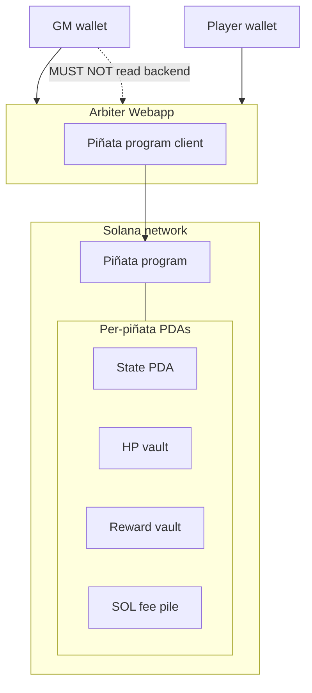

# Deployment

v1 physical layout: who runs what, and where instance state lives. Behavior is in [program.md](program.md) and [arbiter.md](arbiter.md). Interactions among these participants will be in [flows.md](flows.md).

## Figure 1. v1 deployment

Wallets talk to the arbiter webapp. The Piñata program client lives inside that webapp and is how Initialize, Register, Attack, and Close are built. The game master wallet MUST NOT read the arbiter webapp’s backend (policy; [arbiter.md](arbiter.md) **A6**, **O1**).

**Figure 1.** v1 deployment: GM and player wallets use the arbiter webapp. That webapp contains the Piñata program client, which submits to the Piñata program and its per-instance PDAs on Solana.

## Participants

| Participant | Where it runs | Role |
| --- | --- | --- |
| **GM wallet** | Client | Connects to the arbiter webapp. Completes Initialize and Close as fee payer, pays PDA rent. MUST NOT hold live vault ElGamal keys, HP mint supply keys, or the HP mint authority. |
| **Player wallet** | Client | Connects to the arbiter webapp. Signs Register and Attack. Pays the strike fee. |
| **Arbiter Webapp** | Off-chain (frontend, backend, and Piñata program client as one participant) | Primary client for both wallets. Prices the reward, draws HP, holds vault ElGamal keys, HP mint supply keys, and the HP mint authority in the backend, attaches HP proofs, partial-signs mint-authority instructions, builds program transactions. |
| **Piñata program** | Solana | Instructions and settlement. Each instance is a PDA set: state, HP vault, reward vault, SOL pile. Not a user-facing client. |

The arbiter MAY call Jupiter Tokens API v2 for pricing ([arbiter.md](arbiter.md) **A4**). That API is an external dependency of the arbiter, not a fifth deployed component of this system.

Frontend versus backend process split, hosting, and RPC shapes are unspecified. Isolation (**DEP3**, [arbiter.md](arbiter.md) **A6**) applies to backend secrets, not to using the frontend to sign Initialize or Close.

## Decided

Normative language follows RFC 2119.

### DEP1. Components

A v1 deployment MUST include a GM wallet, one or more player wallets, one arbiter webapp, and the Piñata program on a Solana cluster. Each live piñata MUST have its own PDA set: state, HP vault, reward vault, and SOL fee pile.

### DEP2. Arbiter is the webapp

The arbiter MUST be one webapp participant: frontend, backend, and the Piñata program client as a single deployment abstraction, not a separate extra relay and not a second named component. Vault ElGamal keys, HP mint supply ElGamal and AES keys, and the HP mint authority key MUST live in that webapp’s backend, not in the frontend, not in a PDA, and not on the GM wallet after Initialize.

### DEP3. Isolation on the wire

The GM wallet MUST NOT have operational access to the arbiter webapp backend (keys, HP draw, per-strike refuse). Using the frontend to sign Initialize or Close does not count as reading the arbiter. Enforcement is [arbiter.md](arbiter.md) **O1**.

### DEP4. Program client is in the webapp

The Piñata program client MUST live in the arbiter webapp. GM and player wallets MUST use that webapp as their primary interaction surface. They MUST NOT be assumed to hold a separate program client that can complete Initialize or Attack.

Initialize and Attack require ZK proofs generated from backend-held vault ElGamal keys and HP mint supply keys ([arbiter.md](arbiter.md) **A1**, **A2**, **A5**). A wallet-side client without those proofs cannot assemble those transactions. Register and Close do not need vault secrets; v1 still routes them through the same webapp so there is one client, not two.

Confidential HP **mint** (Initialize) requires the HP mint’s mint authority as a Token-2022 signer. Confidential HP **burn** (Attack) does **not**: Token-2022 `ConfidentialBurn` is authorized by the HP vault owner (the instance PDA, via the program) plus the burn proofs. `ApplyPendingBalance` after mint is authorized by that vault owner, not mint authority. `ApplyPendingBurn` and `UpdateDecryptableSupply` require mint authority; they reconcile encrypted and decryptable supply and are not the HP decrement. Who holds mint authority is **DEP5**.

### DEP5. HP mint authority is the arbiter

The HP mint authority MUST be a key held in the arbiter webapp backend. The backend MUST partial-sign `ConfidentialMint` (Initialize) and, on the Attack sequence, `ApplyPendingBurn` then `UpdateDecryptableSupply`. The GM and player wallets MUST NOT hold that key.
