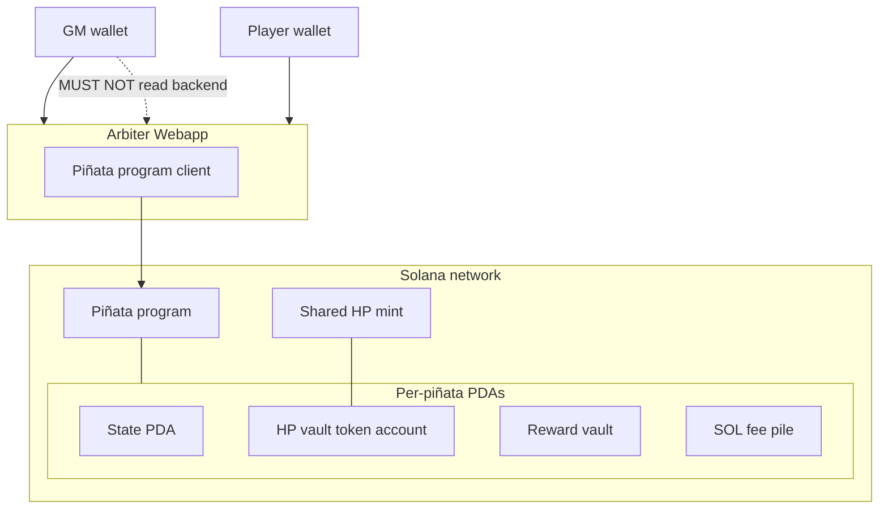

# Deployment

v1 physical layout: who runs what, and where instance state lives. Behavior is in [program.md](program.md) and [arbiter.md](arbiter.md). Interactions among these participants will be in [flows.md](flows.md).

## Figure 1. v1 deployment

Wallets talk to the arbiter webapp. The Piñata program client lives inside that webapp and is how Initialize, Register, Attack, and Close are built. The game master wallet MUST NOT read the arbiter webapp’s backend (policy; [arbiter.md](arbiter.md) **A6**, **O1**).

**Figure 1.** v1 deployment: GM and player wallets use the arbiter webapp. One shared HP mint; each instance has its own HP token account (PDA address, arbiter authority). Reward vault and SOL pile stay program-controlled PDAs.

## Participants

| Participant | Where it runs | Role |
| --- | --- | --- |
| **GM wallet** | Client | Connects to the arbiter webapp. Completes Initialize and Close as fee payer, pays PDA rent. MUST NOT hold live vault ElGamal keys, HP mint supply keys, HP mint authority, or HP vault authority. |
| **Player wallet** | Client | Connects to the arbiter webapp. Signs Register and Attack. Pays the strike fee. |
| **Arbiter Webapp** | Off-chain (frontend, backend, and Piñata program client as one participant) | Primary client for both wallets. Prices the reward, draws HP, holds vault ElGamal keys, HP mint supply keys, and the HP mint and vault authority keys in the backend, attaches HP proofs, partial-signs Token-2022 HP instructions, builds program transactions. |
| **Piñata program** | Solana | Instructions and settlement. Shared HP mint; each instance is a PDA set: state, HP vault token account, reward vault, SOL pile. Not a user-facing client. |

The arbiter MAY call Jupiter Tokens API v2 for pricing ([arbiter.md](arbiter.md) **A4**). That API is an external dependency of the arbiter, not a fifth deployed component of this system.

Frontend versus backend process split, hosting, and RPC shapes are unspecified. Isolation (**DEP3**, [arbiter.md](arbiter.md) **A6**) applies to backend secrets, not to using the frontend to sign Initialize or Close.

## Decided

Normative language follows RFC 2119.

### DEP1. Components

A v1 deployment MUST include a GM wallet, one or more player wallets, one arbiter webapp, the Piñata program on a Solana cluster, and one shared HP mint (**DEP6**). Each live piñata MUST have its own PDA set: state, HP vault token account, reward vault, and SOL fee pile.

### DEP2. Arbiter is the webapp

The arbiter MUST be one webapp participant: frontend, backend, and the Piñata program client as a single deployment abstraction, not a separate extra relay and not a second named component. Vault ElGamal keys, HP mint supply ElGamal and AES keys, the HP mint authority, and the HP vault authority MUST live in that webapp’s backend, not in the frontend, not in a PDA, and not on the GM wallet after Initialize.

### DEP3. Isolation on the wire

The GM wallet MUST NOT have operational access to the arbiter webapp backend (keys, HP draw, per-strike refuse). Using the frontend to sign Initialize or Close does not count as reading the arbiter. Enforcement is [arbiter.md](arbiter.md) **O1**.

### DEP4. Program client is in the webapp

The Piñata program client MUST live in the arbiter webapp. GM and player wallets MUST use that webapp as their primary interaction surface. They MUST NOT be assumed to hold a separate program client that can complete Initialize, Attack, or Close.

Initialize, Attack, and Close require ZK proofs generated from backend-held vault ElGamal keys ([arbiter.md](arbiter.md) **A1**, **A2**, **A5**). Close MUST be arbiter-constructed: after game-over the HP vault still holds an encrypt(0) leftover, not empty bytes, and Token-2022 will not close that account without a leftover-zero proof. The arbiter backend MUST attach that proof and MUST partial-sign as HP vault authority (**DEP6**); the GM wallet MUST complete the transaction as fee payer ([flows.md](flows.md) **F0**) and MUST NOT receive vault ElGamal secrets. Close MUST NOT close the shared HP mint. Register does not need vault secrets; v1 still routes it through the same webapp so there is one client, not two.

Confidential HP Token-2022 roles are **DEP6**. Attack MUST still CPI `ConfidentialBurn` so the hit and the strike fee stay one instruction ([program.md](program.md) **D3**); the vault-authority signer on that CPI is the arbiter, not a PDA. Only the instance HP vault’s confidential balance is that piñata; burning from an unrelated token account is irrelevant. A player MUST NOT assemble Attack.

### DEP5. HP mint authority is the arbiter

The HP mint authority MUST be a key held in the arbiter webapp backend. The backend MUST partial-sign `ConfidentialMint` (Initialize) and, on the Attack sequence, `ApplyPendingBurn` then `UpdateDecryptableSupply`. The GM and player wallets MUST NOT hold that key. This key MAY be the same keypair as HP vault authority (**DEP6**).

### DEP6. Shared HP mint; vault authority is the arbiter

**Names.** On a Solana account, **owner** is the program id that may modify that account’s data. For an HP vault, that owner is Token-2022. **Authority** is the Token-2022 pubkey that signs burns, pending-balance apply, confidential configure, and close of that token account (layout field `owner`). This document uses those two words that way. Mint authority is a different Token-2022 role on the mint.

**Mint.** v1 MUST use one shared HP mint for all piñata instances. The mint is not a per-instance PDA. Close of one instance MUST NOT close that mint.

**Vaults.** Each instance MUST have its own HP token account. That account MUST NOT be an ATA of the arbiter for the shared mint: one authority plus one mint has one ATA, which cannot isolate instances. The HP vault **address** MUST be an instance PDA so the account is locatable. Token-2022 is the runtime owner. The HP vault **authority** MUST be an arbiter backend key, not a PDA. v1 MUST NOT PDA-sign Token-2022 confidential HP instructions. Initialize MAY still allocate that PDA (create-account); that is not a confidential-HP signer.

**Same key.** HP mint authority (**DEP5**) and HP vault authority MAY be the same arbiter keypair. Simplest v1 is one key.

**Reward and SOL.** The public reward vault and the SOL pile MUST remain instance PDAs whose spending path is the Piñata program. They MUST NOT use the arbiter as token or SOL authority. The arbiter is assumed trustworthy and secure for exclusive HP generation and signing.
