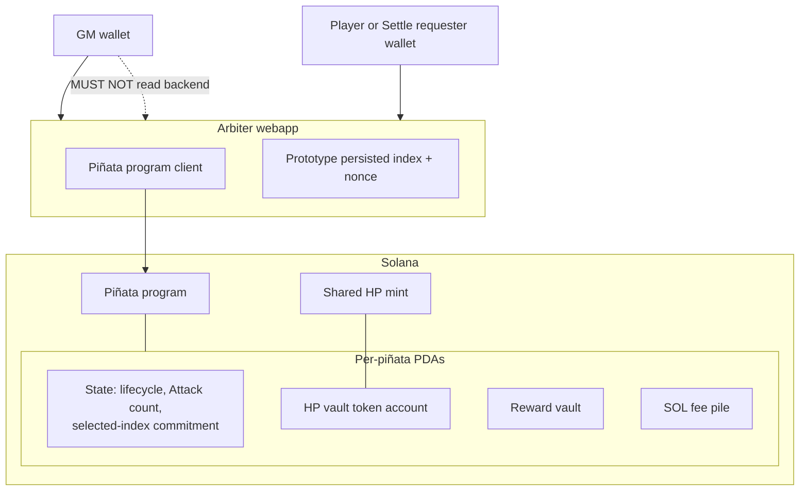
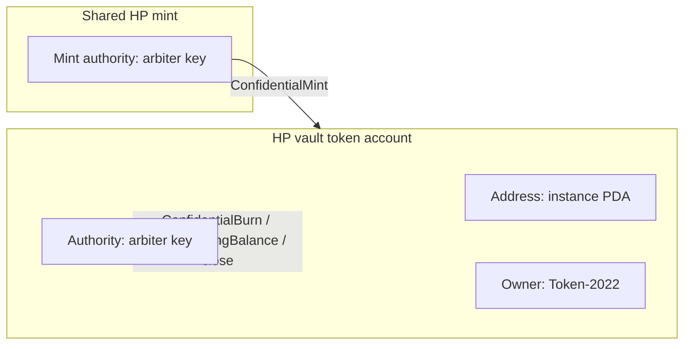

# Deployment

Who runs what, and where instance state lives. Behavior: [program.md](program.md), [arbiter.md](arbiter.md). Sequences: [flows.md](flows.md).

Frontend versus backend process split, hosting, and RPC shapes are unspecified. v1 key storage is [arbiter.md](arbiter.md) **A2**.

Jupiter Tokens API v2 (**A4**) is an external dependency of the arbiter, not an additional deployed game component. No VRF deployment component is defined until the pre-launch provider and lifecycle are chosen (**A8**, [arbiter.md](arbiter.md) **O2**).

## Layout

Wallets talk to the arbiter webapp. The Piñata program client lives **inside** that webapp. The GM wallet MUST NOT read the backend (policy; **A6**, [arbiter.md](arbiter.md) **O1**).

**Figure 1.** One shared HP mint. Each instance has a PDA-addressed HP token account with arbiter authority. Its state PDA holds lifecycle state, successful-Attack count, and the Terminal Attack's selected-index commitment. Exact fields and bytes remain instruction-layout details. Reward vault and SOL pile stay program-controlled and locked through `Drawing`.

There is no separate participation asset or per-strike account. Successful Attack history records chronological index-to-wallet assignments. The arbiter performs the prototype history scan; the program does not scan historical transactions.

> **FUTURE (not v1).** Later versions MUST restrict HP modifications to the Piñata program. Out-of-band HP modification by the arbiter MUST be forbidden: Token-2022 HP operations with no Piñata instruction in the transaction, and HP operations that are only sibling Token-2022 instructions rather than Piñata CPIs. v1 allows both so the Piñata program can have fewer instructions during early development. Honest v1 already uses siblings (`ApplyPendingBalance` after Initialize; `ApplyPendingBurn` / `UpdateDecryptableSupply` after Attack). How later versions bind HP operations to the program is unspecified (**O1** in this file, not [arbiter.md](arbiter.md) **O1**).

## Participants

| Participant | Where | Role |
| --- | --- | --- |
| **GM wallet** | Client | Connects to the webapp. Completes Initialize and Close as fee payer; pays PDA rent. Receives the SOL pile at `Settle` and instance rent at Close. MUST NOT hold live HP keys or authorities. |
| **Player wallet** | Client | Connects to the webapp. Signs Register and Attack. Pays the strike fee. A player may also request `Settle`. |
| **Settle requester wallet** | Client | Any participant requesting settlement. Signs the arbiter-built `Settle` transaction as fee payer and sends it through that wallet's RPC. Need not be the winner, Terminal Attacker, or GM. |
| **Arbiter webapp** | Off-chain (frontend, backend, and program client as **one** participant) | Primary client. Prices the reward, draws HP, holds keys, attaches HP proofs, makes and persists the prototype winner selection, maps its selected index to a wallet from public Attack history, and builds and signs `Settle`. |
| **Piñata program** | Solana | Five instructions, lifecycle enforcement, commitment opening checks, and atomic settlement. Not a user-facing client and cannot scan historical transactions. |

Isolation (**DEP3**, **A6**) applies to **backend secrets**, not to using the frontend to request or sign a transaction.

## Names: owner versus authority

Solana uses “owner” for two different pubkeys. This design uses:

| Word | Meaning |
| --- | --- |
| **Owner** | Runtime program id that may modify the account's **data**. HP vault owner = Token-2022. |
| **Authority** | Token-2022 pubkey that signs burns, pending-balance apply, confidential configure, and close of that token account (layout field still named `owner`). |
| **Mint authority** | Separate Token-2022 role on the **mint** (`ConfidentialMint`, `ApplyPendingBurn`, `UpdateDecryptableSupply`). |

One authority plus one mint implies one **ATA**, which cannot isolate instances, so HP vaults are **not** ATAs.

## Decided

Normative language follows RFC 2119.

### DEP1. Components

A v1 deployment MUST include a GM wallet, one or more participant wallets, one arbiter webapp, the Piñata program on a Solana cluster, and one shared HP mint (**DEP6**). Each live piñata MUST have its own PDA set: state, HP vault token account, reward vault, and SOL fee pile.

The state PDA MUST represent the `Uninitialized`, `Live`, `Drawing`, `GameOver`, and `Closed` lifecycle as applicable, track successful Attack count for the session, and store the terminal selected-index commitment. It MUST NOT store a separate collection of participation objects.

### DEP2. Arbiter is the webapp

The arbiter MUST be one webapp participant: frontend, backend, and the Piñata program client as a single deployment abstraction, not a separate extra relay or named component. HP ElGamal and AES (vault and supply), HP mint authority, HP vault authority, and prototype raffle opening MUST live in that webapp's backend, not in the frontend, a PDA, or the GM wallet before settlement.

v1 MUST keep the arbiter Solana authority keypair in a host-local env file readable by the backend. HP ElGamal and AES MUST be derived from that keypair at runtime and MUST NOT be stored as separate env values. The prototype selected index and nonce MUST be chosen once and persisted securely through settlement (**A2**, prototype raffle selection).

### DEP3. Isolation on the wire

The GM wallet MUST NOT have operational access to the arbiter backend: keys, exact HP, remaining HP, realized offset, exact price quote, pre-settlement selected index/nonce, or per-strike refusal. Using the frontend to sign Initialize or Close does not count as reading the arbiter. The offset range `0..=5` is public. Enforcement is [arbiter.md](arbiter.md) **O1**.

### DEP4. Program client is in the webapp

The Piñata program client MUST live in the arbiter webapp. GM and participant wallets MUST use that webapp as their primary interaction surface. They MUST NOT be assumed to hold a separate program client that can complete Initialize, Attack, Settle, or Close.

Initialize, Attack, and Close require ZK proofs generated from backend-held vault ElGamal keys (**A1**, **A2**, **A5**). Close MUST be arbiter-constructed: after `GameOver` the HP vault still holds an encrypt(0) leftover, not empty bytes, and Token-2022 will not close that account without a leftover-zero proof. The arbiter backend MUST attach that proof and partial-sign as HP vault authority (**DEP6**); the GM wallet completes as fee payer (**F0**). Close MUST NOT close the shared HP mint.

Settle requires the configured arbiter signer and MUST be built by the webapp from the one persisted opening and the player assigned the selected index in successful Attack history. Any participant may request it and completes as fee payer (**F3**). Register does not need vault secrets; v1 still routes it through the webapp so there is one client.

Attack MUST CPI `ConfidentialBurn` so the strike, index assignment, and strike fee stay one instruction (**D3**). The vault-authority signer is the arbiter, not a PDA. Only the instance HP vault's confidential balance is that piñata; burning from an unrelated token account is irrelevant. A player MUST NOT assemble Attack.

### DEP5. HP mint authority is the arbiter

The HP mint authority MUST be a key held in the arbiter webapp backend. The backend MUST partial-sign `ConfidentialMint` during Initialize and `ApplyPendingBurn` then `UpdateDecryptableSupply` after Attack. GM and participant wallets MUST NOT hold that key. It MAY be the same keypair as HP vault authority (**DEP6**).

### DEP6. Shared HP mint; vault authority is the arbiter

**Names.** HP vault runtime **owner** is Token-2022. HP vault **authority** is the Token-2022 pubkey that signs burns, pending-balance apply, confidential configure, and close. Mint authority is a separate Token-2022 role on the mint.

**Mint.** v1 MUST use one shared HP mint for all piñata instances. The mint is not a per-instance PDA. Close of one instance MUST NOT close it.

**Vaults.** Each instance MUST have its own HP token account. It MUST NOT be an ATA of the arbiter for the shared mint. Its **address** MUST be an instance PDA so it is locatable; Token-2022 is runtime owner; an arbiter backend key is authority. v1 MUST NOT PDA-sign confidential HP instructions. Initialize MAY allocate that PDA; allocation is not a confidential-HP signature.

**Same key.** HP mint authority (**DEP5**) and HP vault authority MAY be the same arbiter keypair. Simplest v1 is one key.

**Reward and SOL.** The public reward vault and SOL pile MUST remain instance PDAs whose only spending path is the Piñata program. They MUST remain locked throughout `Live` and `Drawing`. `Settle` MUST spend both atomically through the program: reward to the player assigned the selected index and entire pile to the GM.

> **FUTURE (not v1).** Because mint and vault authority are arbiter keys, Token-2022 accepts HP mint/burn/apply/close from the arbiter without a Piñata CPI, including transactions that never invoke Piñata. v1 accepts that. Later versions MUST forbid it and restrict HP modifications to the Piñata program. Enforcement mechanism: **O1**.

## Still open

### O1. Binding HP mutations to the program (later versions)

This **O1** is not [arbiter.md](arbiter.md) **O1** (GM isolation). Later versions MUST restrict HP Token-2022 mutations to the Piñata program and forbid arbiter out-of-band HP modification. How that is enforced is unspecified: PDA vault/mint authority, extra wrapping instructions, or another bind. v1 does not choose.

The mandatory pre-launch winner VRF has no deployment component yet because its provider and lifecycle are still open in [arbiter.md](arbiter.md) **O2**.
