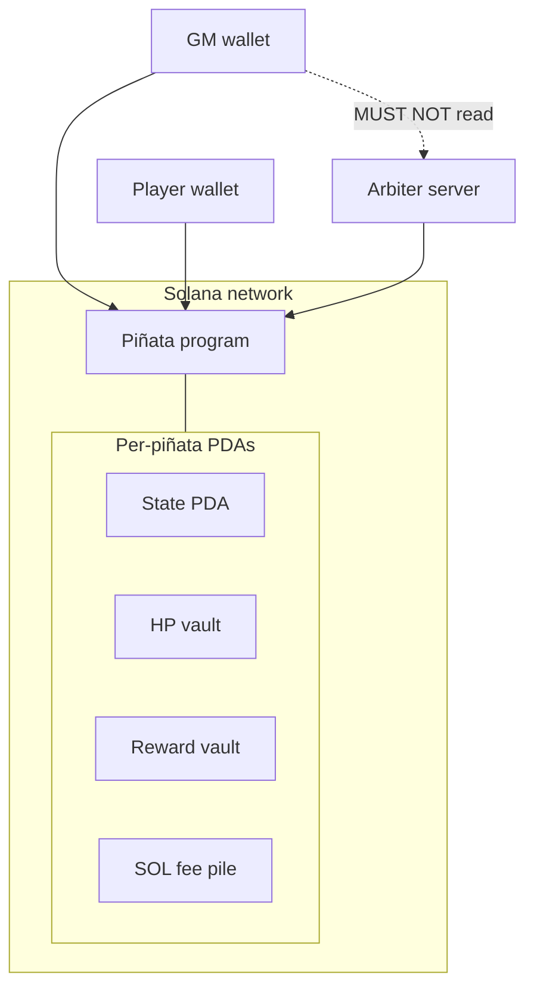

# Deployment

v1 physical layout: who runs what, and where instance state lives. Behavior is in [program.md](program.md) and [arbiter.md](arbiter.md). Interactions among these participants will be in [flows.md](flows.md).

## Figure 1. v1 deployment

Wallets, the arbiter server, and the Piñata program with per-instance PDAs on Solana. The game master wallet MUST NOT read the arbiter server (policy; [arbiter.md](arbiter.md) **A6**, **O1**).

**Figure 1.** v1 deployment: GM wallet, player wallet, arbiter server, and the Piñata program with per-instance PDAs on Solana.

## Participants

| Participant | Where it runs | Role |
| --- | --- | --- |
| **GM wallet** | Client | Signs Initialize, Close, and pays PDA rent. MUST NOT hold live vault ElGamal keys. |
| **Player wallet** | Client | Signs Register and Attack. Pays the strike fee. |
| **Arbiter server** | Off-chain relay (same process as the v1 relay; not a second server) | Prices the reward, draws HP, holds vault ElGamal keys, attaches HP proofs. |
| **Piñata program** | Solana | Instructions and settlement. Each instance is a PDA set: state, HP vault, reward vault, SOL pile. |

The arbiter MAY call Jupiter Tokens API v2 for pricing ([arbiter.md](arbiter.md) **A4**). That API is an external dependency of the arbiter, not a fifth deployed component of this system.

## Decided

Normative language follows RFC 2119.

### DEP1. Components

A v1 deployment MUST include a GM wallet, one or more player wallets, one arbiter server, and the Piñata program on a Solana cluster. Each live piñata MUST have its own PDA set: state, HP vault, reward vault, and SOL fee pile.

### DEP2. Arbiter is the relay

The arbiter server MUST be the existing relay process, not a second server. Vault ElGamal keys MUST live on that server, not in a PDA and not on the GM wallet after Initialize.

### DEP3. Isolation on the wire

The GM wallet MUST NOT have operational access to the arbiter server (keys, HP draw, per-strike refuse). Enforcement is [arbiter.md](arbiter.md) **O1**.
