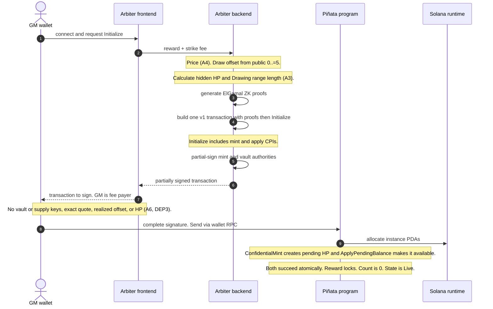
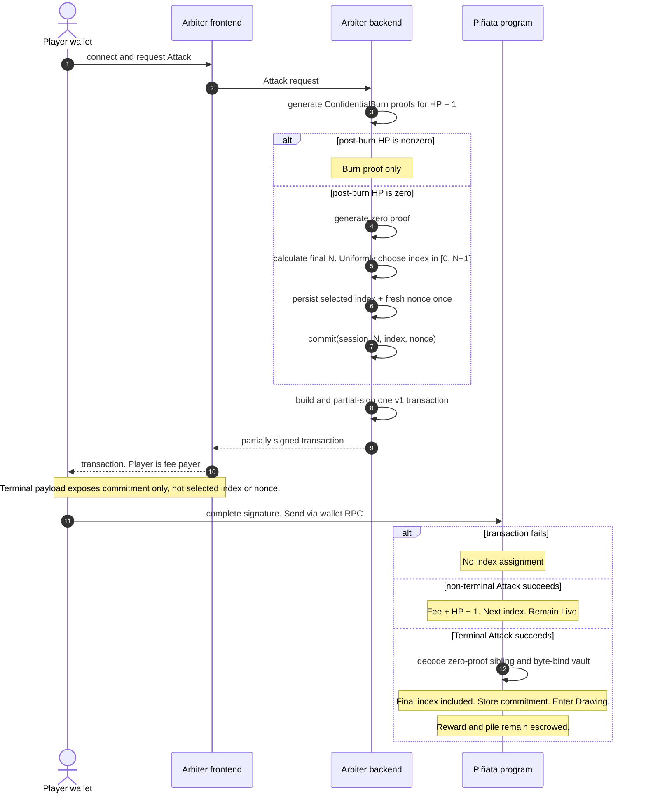
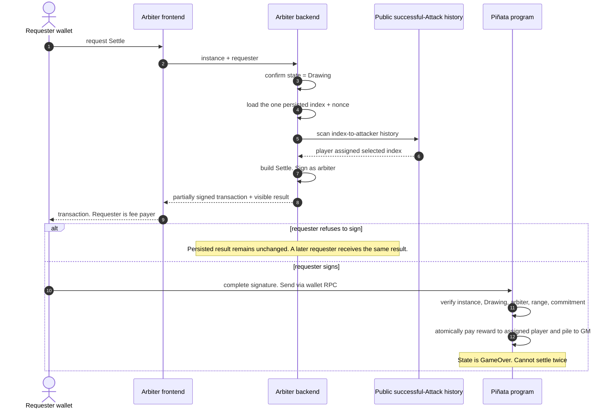

# Flows

Sequences among the participants in [deployment.md](deployment.md). On-chain: [program.md](program.md). Arbiter: [arbiter.md](arbiter.md).

Instruction layouts, account metas, RPC shapes, commitment bytes, and proof byte formats are out of scope.

**F0** applies to every flow. Initialize = **F1**. Attack = **F2**. Settle = **F3**. Reinitialize wire details remain **O2**; Close wire details remain **O3**.

## F0. Wallet connect and send

1. Wallets MUST connect to the arbiter webapp with a Solana wallet adapter.
2. Each interaction MUST be one atomic transaction-v1 message, already assembled and partially signed by the arbiter before the wallet sees it. The connected wallet MUST sign as fee payer: GM for Initialize, Reinitialize, and Close, player for Attack (including strike fee), and requesting participant for Settle.
3. Send MUST use the connected wallet's own RPC, not a webapp-submitted send on its behalf. A wallet MUST NOT receive an unsigned Initialize, Reinitialize, Attack, Settle, or Close to assemble independently.
4. Mint-authority partial-sign = **DEP5**. Vault-authority partial-sign = **DEP6**. Initialize forwards the arbiter's signer privilege to its `ConfidentialMint` and `ApplyPendingBalance` CPIs; Attack does the same for its `ConfidentialBurn` CPI. Settle also requires the configured arbiter authority signature (**D3**).
5. `ApplyPendingBurn` and `UpdateDecryptableSupply` are sibling Token-2022 instructions in prototype v1, not Piñata CPIs. `ApplyPendingBalance` is a CPI inside Initialize. The remaining sibling path is part of the early-development grant; later versions wrap or otherwise bind HP operations ([deployment.md](deployment.md) **DEP6** FUTURE).
6. Proofs MUST be carried inline as data in top-level ZK ElGamal Proof Program instructions. Proof-context and proof-data record accounts MUST NOT be created. Proof instructions precede the consuming Piñata instruction in the same transaction; Token-2022 or Piñata reads the referenced sibling through the instructions sysvar and validates its program, proof type, and decoded public context.
7. The backend MUST reject construction if transaction v1 is unavailable or the final wire transaction exceeds its 4096-byte limit. It MUST NOT fall back to multiple transactions.

## F1. Initialize

Starts the first session from `Uninitialized` only. It MUST fail from `Live`, `Drawing`, or `GameOver`; later sessions use the dedicated Reinitialize instruction (**D4**).

GM supplies the public reward and strike fee but MUST NOT choose HP (**D2**, **A3**). Using the frontend does not count as reading the arbiter (**DEP3**). Prototype Initialize uses wallet-pubkey identity only. SAS attestation is deliberately deferred but MUST be added before product launch; credential and person-id field remain open in [game.md](game.md).

| Who             | What                                                                                                                                                                                                 |
| --------------- | ---------------------------------------------------------------------------------------------------------------------------------------------------------------------------------------------------- |
| GM              | Public reward, strike fee, fee payer, PDA rent, completed signature.                                                                                                                                 |
| Arbiter backend | Jupiter price, realized offset from public range `0..=5`, HP / hidden Drawing range length, `ConfidentialMint` proofs, mint-authority and vault-authority partial-signatures, vault and supply keys. |
| Piñata program  | Initialize, lock reward, reset successful-Attack count, CPI `ConfidentialMint`, then immediately CPI `ApplyPendingBalance` as arbiter vault authority. Enter `Live` only if both CPIs succeed.       |

| Instruction                                          | Effect                                                                                                 | Who authorizes                                             |
| ---------------------------------------------------- | ------------------------------------------------------------------------------------------------------ | ---------------------------------------------------------- |
| `ConfidentialMint` (CPI during Initialize)           | Encrypted initial HP / eventual Drawing range length into this vault's **pending** on the shared mint. | HP mint authority                                          |
| `ApplyPendingBalance` (second CPI inside Initialize) | Pending → **available** atomically with Initialize. Required before any Attack burn.                   | HP vault authority (arbiter transaction signer; not a PDA) |

**MUST**

1. Connect and request Initialize through the webapp (**F0**).
2. Backend performs **A3**, generating confidential HP mint proofs. Exact quote, realized offset, and HP remain backend-only; the `0..=5` range is public.
3. Backend assembles one transaction-v1 message containing, in order, optional `VerifyPubkeyValidity` for first-time HP-vault configuration, `VerifyCiphertextCommitmentEquality`, `VerifyBatchedGroupedCiphertext3HandlesValidity`, `VerifyBatchedRangeProofU128`, and Initialize. Each verification instruction carries its proof bytes as instruction data. Initialize supplies backward sibling offsets and the instructions sysvar to its Token-2022 CPIs; Token-2022 reads and decodes those already-executed proof instructions. No proof-context account is created.
4. Initialize CPIs `ConfidentialMint` and then immediately CPIs `ApplyPendingBalance`. The arbiter partial-signs the final transaction; its signer privilege authorizes the mint and vault operations. No PDA signs either confidential operation.
5. GM completes the single transaction as fee payer and sends it through wallet RPC. Returned payload MUST NOT expose backend secrets or hidden values.
6. Program creates the instance, locks the public reward, sets successful-Attack count to zero, makes HP available, and enters `Live`.

## F2. Attack

A registered player strikes the piñata. Every paid successful Attack burns 1 HP and assigns the attacking wallet the next zero-based chronological index. More successful strikes give that wallet more indexes in the eventual Drawing range and therefore higher odds. The prototype does not enforce SAS identity or rejection by GM person id; both MUST be added before product launch as specified in [game.md](game.md).

| Instruction               | Effect                                                                                                 | Who authorizes                |
| ------------------------- | ------------------------------------------------------------------------------------------------------ | ----------------------------- |
| `ConfidentialBurn`        | Homomorphic −1 on this vault: the successful strike paired with one index assignment. CPI from Attack. | Vault authority + burn proofs |
| `ApplyPendingBurn`        | Shared mint `pending_burn` → encrypted supply. Not the strike or index record.                         | Mint authority                |
| `UpdateDecryptableSupply` | Mint AES decryptable supply after `ApplyPendingBurn`. Not the strike or index record.                  | Mint authority + supply AES   |

Terminal closure is not “vault bytes look like zero.” It is a top-level `VerifyZeroCiphertext` sibling on this Attack, executed before Attack and then decoded and byte-bound to the post-burn vault by Piñata (**D3**).

| Branch       | Arbiter puts on Attack                                                                                                                                                   | On chain                                                                                                                                         |
| ------------ | ------------------------------------------------------------------------------------------------------------------------------------------------------------------------ | ------------------------------------------------------------------------------------------------------------------------------------------------ |
| Non-terminal | Burn proofs only. MUST NOT include `VerifyZeroCiphertext`.                                                                                                               | Fee and burn succeed; assign the wallet's next chronological index; increment count; remain `Live`. No payout.                                   |
| Terminal     | Burn proofs, `VerifyZeroCiphertext` for post-burn `available_balance`, and a hiding/binding commitment to session, final `N`, persisted selected index, and fresh nonce. | Verify and bind; fee and burn succeed; assign index `N - 1`; set final Drawing range `[0, N - 1]`; store commitment; enter `Drawing`. No payout. |

Failed transactions receive no index. Omitting the zero proof when post-burn HP is zero is **A7**; only a malicious or exploited arbiter can land that path because a player cannot rebuild the already-partial-signed Attack (**F0**).

All Attack proof instructions and state changes MUST fit in one transaction-v1 message. Payout MUST NOT occur in Attack.

**MUST**

1. Player connects and requests Attack through the webapp (**F0**).
2. Backend generates burn proofs. If post-burn HP is zero, it also generates the bound zero proof, calculates final `N`, uniformly chooses one index from the Drawing range `[0, N - 1]`, generates a fresh nonce, persists that choice once, and supplies only the commitment (**A5**, prototype raffle selection).
3. Backend builds one v1 transaction containing proof instructions → Attack with `ConfidentialBurn` CPI → `ApplyPendingBurn` → `UpdateDecryptableSupply`, and partial-signs the required vault and mint authority operations.
4. Player completes that transaction as fee payer and sends it through wallet RPC. The payload MUST NOT expose backend keys, exact quote, realized offset, HP, remaining HP, or the selected index/nonce.
5. A successful Attack assigns its wallet the next zero-based chronological index. The Terminal Attack's index is included in the Drawing range. A non-terminal Attack remains `Live`; a valid Terminal Attack enters `Drawing`. Neither pays reward or pile.

## F3. Settle

Any participant may request settlement through the arbiter webapp once the instance is `Drawing`. The requesting wallet is fee payer; it need not be the player assigned the selected index, Terminal Attacker, or GM.

**MUST**

1. Any participant requests settlement through the webapp.
2. Arbiter confirms the instance is `Drawing`.
3. Arbiter loads, without changing, the persisted final `N`, selected index, and nonce.
4. Arbiter scans chronological successful-Attack history and identifies the wallet assigned the selected index. The program does not scan historical transactions; prototype v1 trusts this mapping.
5. Arbiter builds `Settle`, reveals the selected index and nonce, supplies that player's reward account, and signs as configured arbiter authority.
6. Requester signs as fee payer and sends through their wallet RPC.
7. Program verifies the correct instance, state `Drawing`, configured arbiter signer, `index < N`, and the commitment opening bound to session, `N`, index, and nonce.
8. Program atomically pays the entire public reward to the player assigned the selected index and the entire SOL pile to the GM.
9. Program enters `GameOver`; the state guard prevents a second settlement.

If a requester refuses after seeing the result, the arbiter MUST return the same committed result to every subsequent requester. Refusal can delay settlement but cannot trigger a reroll. Arbiter refusal to build or sign remains a censorship/liveness risk (**A7**).

## Decided

Normative language follows RFC 2119. **F0** applies to every flow. **F1**, **F2**, and **F3** are the Initialize, Attack, and Settle specifications.

## Still open

### O2. Reinitialize wire details

Reinitialize is a dedicated instruction reserved for `GameOver → Live`; it MUST NOT be implemented as a branch inside Initialize. Its proof set, zero-vault binding, reward reload, session reset, and account list remain unspecified. It will follow **F0** as one atomic transaction-v1 message. The current implementation MUST expose only a fail-closed stub that performs no CPI or state mutation.

### O3. Close wire details

Close is arbiter-constructed (**DEP4**, **D4**). The shared HP mint MUST NOT be closed with the instance (**DEP6**). Unspecified: exact Token-2022 close and leftover-zero proof instructions besides `VerifyZeroCiphertext` bound to the HP vault; Register/Close sequence diagrams.

### O4. Pre-launch VRF wire flow

Before launch, winner selection MUST use VRF or equivalent publicly verifiable, unpredictable randomness (**A8**). Provider, request/reveal lifecycle, state fields, transaction sequence, and fee funding are undecided. An asynchronous design may commit a randomness request when striking closes rather than retain the prototype selected-index commitment. The flow also depends on whether the program must enforce index-to-attacker mapping on-chain or a publicly reproducible successful-Attack-history scan is sufficient ([arbiter.md](arbiter.md) **O2**). No wire flow is invented until those choices are made.
