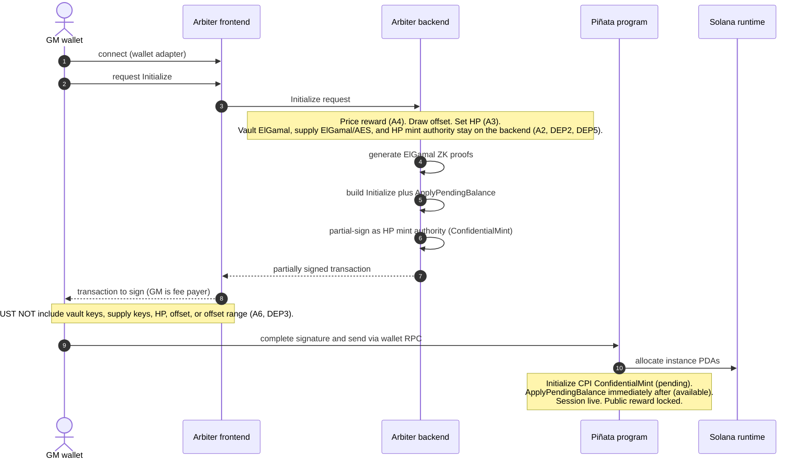
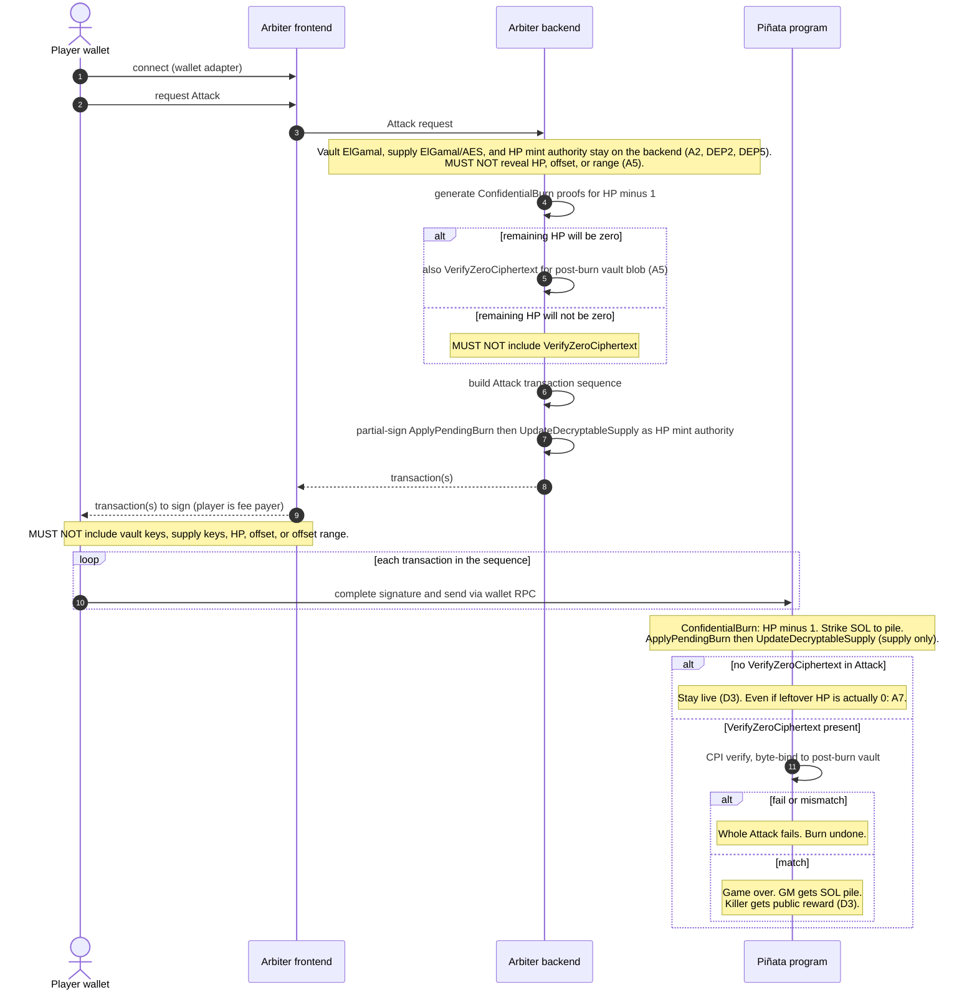

# Flows

Sequence diagrams among the participants in [deployment.md](deployment.md). Wallets use the arbiter webapp; the Piñata program client lives there ([deployment.md](deployment.md) **DEP4**). On-chain rules: [program.md](program.md). Arbiter behavior: [arbiter.md](arbiter.md).

Instruction layouts, account metas, RPC shapes, and proof byte formats are out of scope here.

## F1. Initialize

How the game master starts a session (also a new session after game-over; [program.md](program.md) **D4**). Connect, sign, and send follow **F0**. HP formula: [arbiter.md](arbiter.md) **A3**. Isolation: [arbiter.md](arbiter.md) **A6**, [deployment.md](deployment.md) **DEP3**. Mint authority: [deployment.md](deployment.md) **DEP5**. PDAs: [deployment.md](deployment.md) **DEP1**.

The game master MUST supply the public reward and the strike fee. The game master MUST NOT choose HP (**D2**, **A3**). Using the frontend for this flow does not count as reading the arbiter (**DEP3**). Initialize also requires a SAS attestation ([game.md](game.md)); which credential or person-id field is still open there.

### Reward vs HP

| Who | What |
| --- | --- |
| GM | Public reward, strike fee, fee payer (PDA rent). Completes the signature. |
| Arbiter backend | Jupiter price, hidden offset, HP, `ConfidentialMint` proofs, mint-authority partial-sign, vault and supply keys. |
| Piñata program | Initialize (CPI `ConfidentialMint`). Immediately after: `ApplyPendingBalance` as vault owner. |

### Pending vs available

| Instruction | What it does | Who authorizes |
| --- | --- | --- |
| `ConfidentialMint` (CPI during Initialize) | Encrypted HP into the vault’s **pending** balance. | HP mint authority (arbiter backend partial-sign) |
| `ApplyPendingBalance` (next instruction) | Folds pending into **available**. Required before any Attack burn. | HP vault owner (instance PDA, via the program) |

### Sequence

**Figure 1.** Initialize sequence. GM connects with a wallet adapter, requests Init, completes the arbiter’s partially signed transaction as fee payer, and sends via the wallet RPC. The Piñata program initializes and confidential-mints HP; `ApplyPendingBalance` follows immediately so that HP is available.

### Path

1. **Connect.** GM wallet MUST connect to the arbiter webapp (**F0**).
2. **Request.** GM MUST request Initialize from the frontend (public reward and strike fee). Frontend MUST forward to the backend.
3. **Proofs.** Backend MUST perform **A3** (price, offset, HP) and MUST generate the ElGamal ZK proofs for the confidential HP mint. Proof generation MUST stay on the backend (**A2**).
4. **Build.** Backend MUST assemble Initialize (CPI `ConfidentialMint`) and MUST put `ApplyPendingBalance` immediately after as the next instruction. That apply MUST be CPI-signed by the program as HP vault owner (a PDA cannot sign a top-level Token-2022 instruction). Backend MUST partial-sign as HP mint authority (`ConfidentialMint`, **DEP5**) and MUST supply the new decryptable available balance for `ApplyPendingBalance` (vault AES). Frontend MUST return that transaction to the GM wallet for completion (**F0**).
5. **Sign and send.** Returned transaction and any frontend payload MUST NOT include vault ElGamal secrets, supply ElGamal or AES secrets, the HP draw, `offset`, or the offset range. GM MUST complete the signature as fee payer and send via the wallet RPC (**F0**).
6. **On chain.** Piñata program MUST initialize the instance. Solana runtime MUST allocate that instance’s PDAs. Initialize MUST confidential-mint HP into pending. `ApplyPendingBalance` MUST follow immediately so minted HP is available. Session is live; public reward is locked.

## F2. Attack

How a registered player strikes. Connect, sign, and send follow **F0**. On-chain result: [program.md](program.md) **D3**. Proofs and isolation: [arbiter.md](arbiter.md) **A2**, **A5**. Mint authority: [deployment.md](deployment.md) **DEP5**.

Attack deals 1 HP. The player MUST already be registered on this instance. The game master’s person id MUST NOT Attack ([game.md](game.md)). Attack also requires a SAS attestation; which credential or person-id field is still open there.

### HP vs supply

| Instruction | What it does | Who authorizes |
| --- | --- | --- |
| `ConfidentialBurn` | Homomorphic −1 on the HP vault. This **is** the hit. | HP vault owner (instance PDA, via the program) plus burn proofs |
| `ApplyPendingBurn` | Folds mint `pending_burn` into encrypted supply. **Not** the HP decrement. | HP mint authority (arbiter backend partial-sign) |
| `UpdateDecryptableSupply` | Refreshes mint AES decryptable supply after `ApplyPendingBurn`. **Not** the HP decrement. | HP mint authority (arbiter backend partial-sign; supply AES) |

### Live vs kill

`ConfidentialBurn` is the hit either way. Kill is not “vault bytes look like zero.” It is a `VerifyZeroCiphertext` in this Attack, CPI-verified and byte-bound to the post-burn vault ([program.md](program.md) **D3**).

| Branch | What the arbiter puts on Attack | On chain |
| --- | --- | --- |
| Live | Burn proofs only. MUST NOT include `VerifyZeroCiphertext`. | Stay live. No payout. |
| Kill | Burn proofs plus `VerifyZeroCiphertext` for the post-burn `available_balance` blob (not a fresh `Encrypt(0)`). | CPI verify, bind to vault, pay pile and reward or fail the whole Attack. |

Omitting the kill proof when leftover HP is actually 0 is arbiter censorship, not a live-path leftover-nonzero proof ([arbiter.md](arbiter.md) **A7**).

### Sequence

**Figure 2.** Attack sequence. Proof setup may precede Attack if proofs do not fit in one legacy/v0 transaction. `ConfidentialBurn` decrements HP; `ApplyPendingBurn` then `UpdateDecryptableSupply` follow immediately and only reconcile mint supply. Live versus kill is whether `VerifyZeroCiphertext` is on this Attack and binds to the post-burn vault (**D3**).

### Path

1. **Connect.** Player wallet MUST connect to the arbiter webapp (**F0**).
2. **Request.** Player MUST request Attack from the frontend. Frontend MUST forward to the backend.
3. **Proofs.** Backend MUST generate the Token-2022 proofs `ConfidentialBurn` requires for a homomorphic −1 on the HP vault. If that debit leaves remaining HP at zero, backend MUST also attach `VerifyZeroCiphertext` for the post-burn vault `available_balance` blob (**A5**). If remaining HP will not be zero, backend MUST NOT attach that proof. Proof generation MUST stay on the backend (**A2**).
4. **Build.** Backend MUST assemble: proof setup as needed → Attack with `ConfidentialBurn` (HP − 1) and, on a kill, `VerifyZeroCiphertext` → `ApplyPendingBurn` immediately after → `UpdateDecryptableSupply`. Arbiter MUST partial-sign `ApplyPendingBurn` and `UpdateDecryptableSupply` as HP mint authority (**DEP5**).
5. **Fit.** If those proofs do not fit in one legacy/v0 transaction, the webapp MUST return a sequence and the player MUST sign each. Kill settlement MUST remain atomic in the Attack instruction (**D3**); earlier transactions are proof setup only. When Solana Transaction v1 (SIMD-0385, 4096-byte transactions) is usable on the target cluster, the webapp SHOULD collapse to one transaction and one player signature.
6. **Sign and send.** Frontend MUST return the transaction(s). Player MUST complete each signature as fee payer (strike fee included) and send via the wallet RPC (**F0**). Returned payloads MUST NOT include vault ElGamal secrets, supply ElGamal or AES secrets, remaining HP, the HP draw, `offset`, or the offset range. Arbiter MUST NOT expose per-strike refusal to the game master (**A5**).
7. **On chain.** Program MUST debit one HP (`ConfidentialBurn`) and credit the strike fee to the instance SOL pile. Live versus kill MUST follow **D3**: no `VerifyZeroCiphertext` → stay live; proof present → CPI verify, byte-bind to the post-burn vault, then pay or fail the whole Attack.

## Decided

Normative language follows RFC 2119. **F0** applies to every flow in this document. Initialize is specified in **F1** and Attack in **F2** (not repeated here).

### F0. Wallet connect and send

1. Wallets MUST connect to the arbiter webapp with a Solana wallet adapter.
2. The webapp MUST supply the transaction(s). The connected wallet MUST sign as fee payer (GM pays Initialize rent; player pays Attack, including the strike fee). Send MUST use that wallet’s own RPC, not a webapp-submitted send on their behalf.
3. Where a Token-2022 instruction requires the HP mint authority, the arbiter backend MUST partial-sign before the wallet completes the transaction ([deployment.md](deployment.md) **DEP5**).

## Still open

### O1. Initialize wire details

`ApplyPendingBalance` immediately after `ConfidentialMint` is specified in **F1**. Still unspecified: which ElGamal proof kinds are attached at Initialize; other dependent instructions besides that pair (for example account configure); whether vault ElGamal keys and supply keys are generated per session or reused on a later Initialize of the same piñata.
