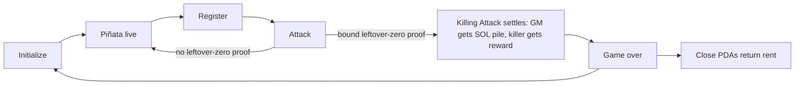

# Game

Smash a **glass piñata**: you can see the prize, not how much HP is left. Several can be live at once; each is independent.

## Roles

- **Game master** — the house. Initializes a piñata through the **arbiter webapp**, locks a **public** reward, sets the strike fee, receives the SOL pile at game-over. Does **not** pick HP. May speculate a break-even floor from public prices; does not know the arbiter’s quote, the offset, or remaining HP exactly. Must not operate live confidential proofs or see the draw: those sit on the **arbiter**.
- **Arbiter** — v1 webapp (frontend, backend, and Piñata program client). Specified in [arbiter.md](arbiter.md). Primary client for GM and players ([deployment.md](deployment.md) **DEP4**). Prices HP, holds vault keys and HP mint supply keys in the backend, attaches proofs. The game master MUST NOT read the backend.
- **Player** — registers and attacks through the arbiter webapp, pays SOL to attack, may win the public token reward. Sees the prize. Does not know remaining HP.
- **Identity** — every participant presents a SAS attestation whose person id is unique. The GM cannot Attack this piñata (same person id). A second wallet with a second attestation for the same person is an issuer failure.

## Rules

- Each **Attack** deals **1 HP**
- A registered player may Attack **without a cap** while the piñata is live
- Strike SOL goes into **that piñata’s pile** — not the player prize
- The prize is the **public token reward** (vault balance)
- On the killing blow: game master gets the SOL pile; killer gets the reward. Kill is the Attack that carries a bound leftover-HP-zero proof ([program.md](program.md) **D3**). An omitted last-hit proof is arbiter censorship ([arbiter.md](arbiter.md) **A7**).
- The game master’s **person id** cannot Attack. The game master MUST NOT read the arbiter ([arbiter.md](arbiter.md) **A6**). Enforcement is still open (**O1**).
- After a kill: **Close** (GM only; rent back to the GM) or **Initialize** again (new session, same piñata)

## Session loop

## Why the hidden amounts matter

Every strike is a bet against **unknown remaining HP** for a **known** prize. The public SOL pile grows with each strike (visible strike count). Exact HP stays encrypted. The reward vault is in the clear.

The GM does not choose HP and does not know remaining HP. The arbiter prices the prize in SOL from Jupiter (`usdPrice`) and adds a hidden offset (**including 0**). Offset 0 matches the arbiter’s break-even pile; above 0 is extra SOL for the house. Public Jupiter quotes let people **guess** a floor; the arbiter’s quote and the offset range are not published. There is no public ceiling, so nobody (including the GM) knows when the next hit must kill.

Exact HP lives on the **arbiter** (vault keys). An optional auditor may also see the confidential HP mint amount; that is not how the GM is supposed to learn HP.

At game-over, strike count equals realized initial HP, so **realized** HP becomes public. Remaining HP during play stays hidden from anyone who did not see the draw.

Players judge a game master by **session history** (SAS person id is stable). That is the reason to strike, not a guaranteed fair pot. The jackpot is always visible. **Realized HP history is public** (strike count at game-over). Trash reward is public — skip it.

## Decided

- **Glass piñata:** public reward, hidden remaining HP, fixed SOL strike fee. Many live piñatas; fees go to that piñata’s pile
- GM locks reward and sets the fee. GM does **not** pick HP
- **1 HP** per Attack. **Unlimited Attacks** per attested player while live. Strike count is not distinct-player count
- **SAS unique-person identity.** Initialize, Register, and Attack require a Solana Attestation Service attestation ([attest.solana.com](https://attest.solana.com/)). The issuer’s KYC (or equivalent) is **1 human ↔ 1 attestation**. The program records the GM’s person id at Initialize and **rejects Attack** if the attacker’s person id is the GM’s. Last-hit snipe via a second wallet is closed **on-chain**, conditional on issuer uniqueness and a comparable person-id in the schema
- v1 **trusts the SAS issuer** not to attest the same person on two wallets. SAS binds a claim to an account; person uniqueness is issuer policy plus an on-chain person-id check, not a property of SAS by itself
- Play reason is **GM reputation across sessions**, not on-chain +EV. Offset may be 0, so extra SOL for the house is not guaranteed every session
- Later (not v1): confidential range of strike damage per player (would replace fixed 1 HP)

## Still open

- **Which SAS credential/schema**, and which attestation field is the person id the program compares
