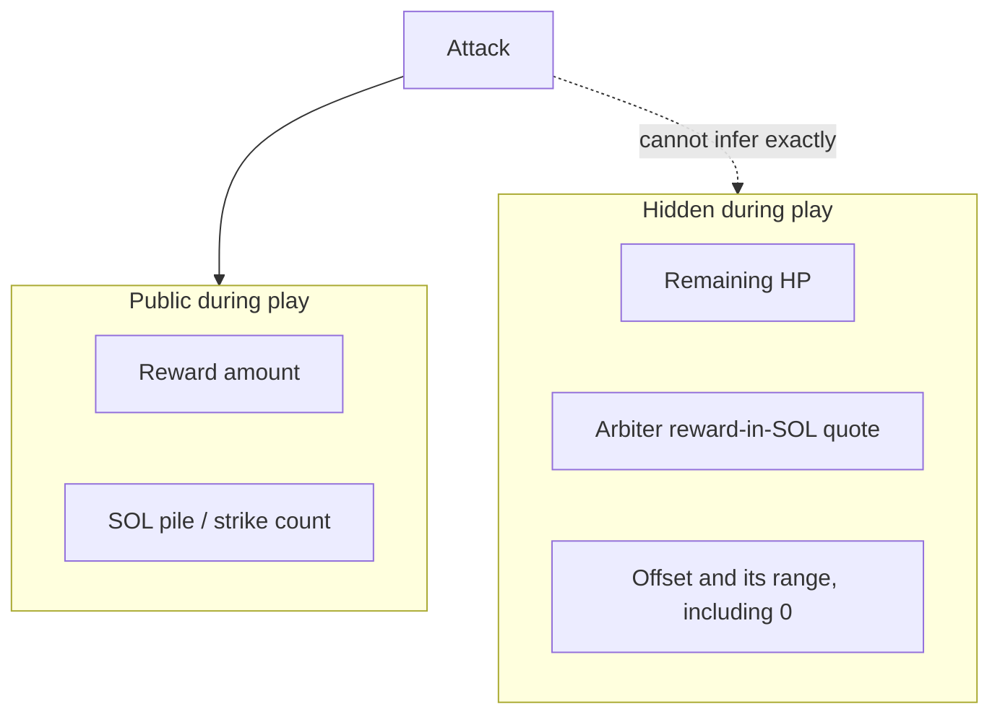

# Game

Player-facing loop. On-chain pay rules: [program.md](program.md). Off-chain HP draw: [arbiter.md](arbiter.md). Layout: [deployment.md](deployment.md).

Several piñatas can be live at once. Each is independent.

```mermaid
flowchart LR
  init[Initialize] --> live[Live]
  live --> register[Register]
  register --> attack[Attack]
  attack -->|"no leftover-zero proof"| live
  attack -->|"bound leftover-zero proof"| settle[Killing Attack]
  settle --> over[Game over]
  over --> close[Close — rent to GM]
  over --> init
```

**Kill / win** = zero leftover HP. The program pays only when Attack bound-proves that leftover (**D3**). Last-HP burn without that proof is malicious/exploited arbiter only (**A7** / **A5**).

## Roles

| Role | Does | Does not |
| --- | --- | --- |
| **Game master** | Locks a **public** reward, sets the strike fee, funds Initialize PDA rent, completes Initialize and Close as fee payer, receives reclaimed account rent on Close, and receives the SOL pile at game-over. Uses the [arbiter webapp](deployment.md). | Pick HP. Know the arbiter’s quote, the offset, or remaining HP exactly. Operate live proofs or read the backend (**A6**; enforcement [arbiter.md](arbiter.md) **O1**). |
| **Arbiter** | v1 webapp (frontend, backend, program client). Prices HP, holds keys, attaches proofs. Primary client for GM and players (**DEP4**). | — |
| **Player** | Registers and Attacks through the webapp. Pays SOL. May win the public token reward. Sees the prize. | Know remaining HP. |

**Identity.** Prototype development uses wallet pubkeys only. [SAS](https://attest.solana.com/) unique-person identity and the GM-person Attack exclusion are deliberately deferred to avoid scope creep, but they MUST be implemented before product launch. The prototype does not prevent the same person from participating through another wallet and MUST NOT be treated as launch-ready identity enforcement.

## Rules

| Rule | Detail |
| --- | --- |
| Damage | Each Attack deals **1 HP**. |
| Cap | A registered player may Attack **without a cap** while live. Strike count is not distinct-player count. |
| Strike fee | Fixed SOL into **that piñata’s pile**, not the player prize. |
| Prize | Public token reward (vault balance). |
| Killing blow | GM gets the SOL pile. Killer gets the reward. |
| After a kill | **Close** (GM signs an arbiter-built teardown; rent back to the GM) or **Initialize** again (new session, same piñata). |

## Why HP is hidden

Every strike is a bet against **unknown remaining HP** for a **known** prize.



| Fact | Why it matters |
| --- | --- |
| GM does not choose HP | House cannot pick a winner by drawing a convenient number. |
| Offset **including 0** | Offset 0 matches the arbiter’s break-even pile. Above 0 is extra SOL for the house. Extra SOL is **not** guaranteed every session. |
| No public ceiling | Nobody (including the GM) knows when the next hit must kill. Public Jupiter quotes let people **guess** a floor; the arbiter’s quote and offset range are not published. |
| Exact HP on the arbiter | Vault keys. An optional auditor may see the confidential mint amount; that is not how the GM is supposed to learn HP ([confidential-balances.md](confidential-balances.md)). |
| At game-over | Strike count **is** realized initial HP **if** HP changed only via conforming Attacks (1 HP each). Out-of-band HP mutation ([deployment.md](deployment.md) **DEP6** FUTURE) breaks that. Remaining HP during play stays hidden from anyone who did not see the draw. |
| Play reason | **GM reputation across sessions**, not on-chain +EV. Prototype reputation is wallet-address based; before product launch, a SAS person id MUST make identity stable across wallets. The jackpot is always visible. **Realized HP history is public.** Trash reward is public — skip it. |

## Decided

Normative language follows RFC 2119.

- **Glass piñata:** public reward, hidden remaining HP, fixed SOL strike fee. Many live piñatas; fees go to that piñata’s pile.
- GM locks reward and sets the fee. GM does **not** pick HP.
- **1 HP** per Attack. **Unlimited Attacks** per registered player while live. Strike count is not distinct-player count.
- **Prototype identity scope.** Prototype development uses wallet pubkeys only. SAS, unique-person enforcement, and rejection of Attacks by the GM’s person id are deliberately deferred and MUST be implemented before product launch. The prototype does not close same-person multi-wallet behavior.
- **Before product launch:** Initialize, Register, and Attack MUST require a Solana Attestation Service attestation. The issuer’s KYC (or equivalent) MUST be **1 human ↔ 1 attestation**. The program MUST record the GM’s person id at Initialize and MUST reject Attack if the attacker’s person id is the GM’s. Last-hit snipe via a second wallet is closed on-chain only conditional on issuer uniqueness and a comparable person-id in the schema. The product trusts the SAS issuer not to attest the same person on two wallets; SAS binds a claim to an account, while person uniqueness is issuer policy plus an on-chain person-id check.
- Play reason is **GM reputation across sessions**, not on-chain +EV. Offset may be 0, so extra SOL for the house is not guaranteed every session.
- Later (not v1): confidential range of strike damage per player (would replace fixed 1 HP).

## Still open

- **Before product launch:** which SAS credential/schema, and which attestation field is the person id the program compares.
