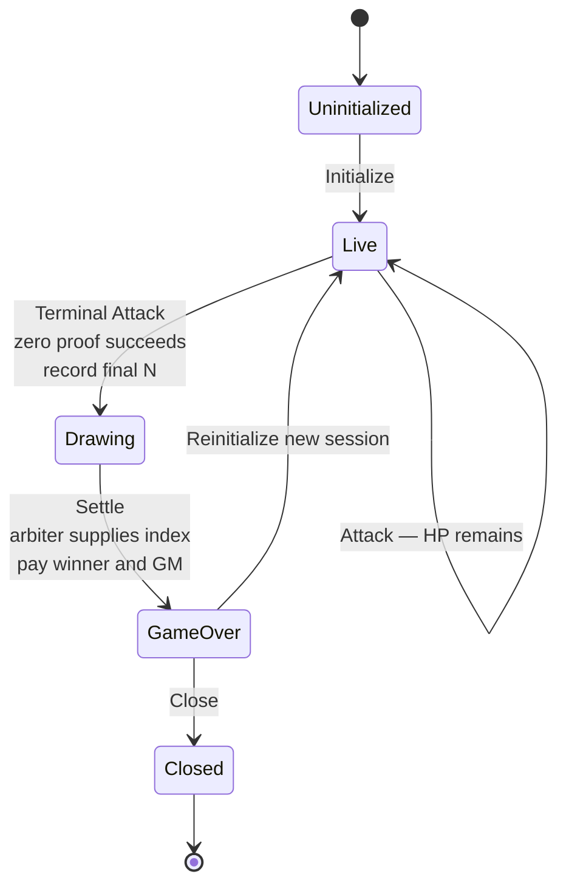
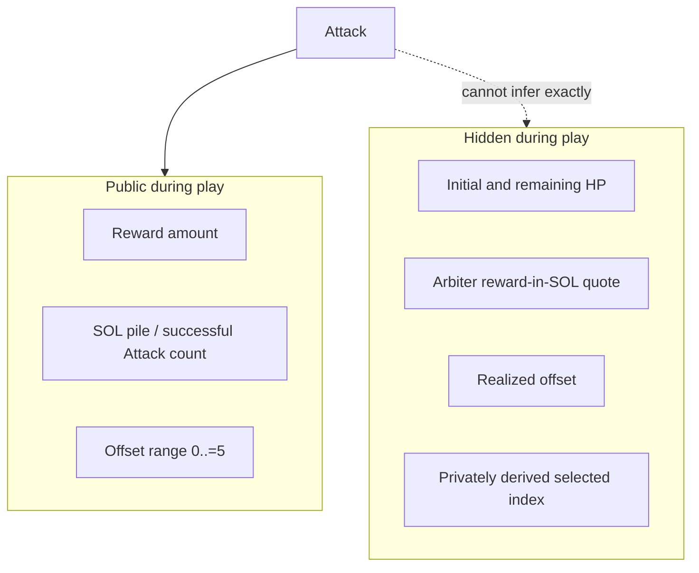

# Game

Player-facing mystery-supply raffle loop. On-chain pay rules: [program.md](program.md). Off-chain HP and prototype winner draws: [arbiter.md](arbiter.md). Layout: [deployment.md](deployment.md).

Several piñatas can be live at once. Each is independent.

Initial hidden HP determines how many successful strikes the piñata can absorb and therefore the hidden length of the Drawing's random range. Every paid, successful Attack burns exactly 1 HP and assigns its attacking player wallet the next index: 0 for the first successful strike, 1 for the second, and so on. Failed transactions receive no index.

The Attack that reduces HP to zero is the **Terminal Attack** (or **Breaking Attack**). It receives the final index and closes striking, but its attacker does not automatically win. The instance enters `Drawing` with final `N`; reward and SOL pile remain escrowed until `Settle` supplies the selected index and pays the player assigned to it (**D3**).

## Roles

| Role            | Does                                                                                                                                                                                                                                                                | Does not                                                                                                                                                                              |
| --------------- | ------------------------------------------------------------------------------------------------------------------------------------------------------------------------------------------------------------------------------------------------------------------- | ------------------------------------------------------------------------------------------------------------------------------------------------------------------------------------- |
| **Game master** | Locks a **public** reward, sets the strike fee, funds Initialize PDA rent, completes Initialize, Reinitialize, and Close as fee payer, receives reclaimed account rent on Close, and receives the SOL pile at settlement. Uses the [arbiter webapp](deployment.md). | Pick HP. Know the arbiter's exact quote, realized offset, or remaining HP during play. Operate live proofs or read the backend (**A6**; enforcement [arbiter.md](arbiter.md) **O1**). |
| **Arbiter**     | v1 webapp (frontend, backend, program client). Prices HP, holds keys, attaches proofs, privately derives the same prototype winner for every `Settle`, and constructs and signs it. Primary client for GM and players (**DEP4**). | Provide trustless or verifiable prototype randomness. |
| **Player**      | Registers and may Attack repeatedly through the webapp. Each paid successful Attack adds one of that wallet's indexes to the Drawing range, so striking more increases its odds. Any participant may request `Settle` and pay its transaction fee.                  | Know exact remaining HP during play or the selected index before a `Settle` transaction is built. |

**Identity.** Prototype development uses wallet pubkeys only. [SAS](https://attest.solana.com/) unique-person identity and the GM-person Attack exclusion are deliberately deferred to avoid scope creep, but they MUST be implemented before product launch. The prototype does not prevent the same person from participating through another wallet and MUST NOT be treated as launch-ready identity enforcement.

## Rules

| Rule              | Detail                                                                                                                                                                                                                               |
| ----------------- | ------------------------------------------------------------------------------------------------------------------------------------------------------------------------------------------------------------------------------------ |
| Strike and index  | Each successful Attack pays the fixed SOL strike fee, burns **1 HP**, and assigns the attacking wallet the next zero-based chronological successful-Attack index. Failed transactions receive no index.                              |
| Cap               | A registered player may Attack **without a cap** while `Live`. Every paid successful Attack adds another index for that wallet and increases its probability proportionally.                                                         |
| Strike fee        | Fixed SOL into **that piñata's pile**, not the player prize.                                                                                                                                                                         |
| Prize             | Public token reward (vault balance). Every successful strike's index remains eligible through the Drawing.                                                                                                                           |
| Terminal Attack   | Receives the final index, closes striking, records final `N`, and enters `Drawing`. No payout occurs. |
| Settle            | Supplies the privately derived index. The player assigned that index gets the entire public reward; the GM gets the entire SOL pile. The instance enters `GameOver`. |
| Terminal attacker | Wins only if the selected index was assigned to them. |
| After settlement  | **Close** (GM signs an arbiter-built teardown; rent back to the GM) or the dedicated **Reinitialize** instruction (new session, same piñata). Reinitialize is currently a fail-closed stub, so session reuse is not yet operational. |

## Why HP is hidden

Every successful strike adds one index to a Drawing range whose final length is unknown during play. A wallet that strikes more occupies more indexes in that range and therefore has higher odds of receiving the public reward.

| Fact                    | Why it matters                                                                                                                                                                                                                                                                                      |
| ----------------------- | --------------------------------------------------------------------------------------------------------------------------------------------------------------------------------------------------------------------------------------------------------------------------------------------------- |
| GM does not choose HP   | House cannot pick the Drawing range length by choosing a convenient strike count.                                                                                                                                                                                                                   |
| Public offset range     | v1 publishes `0..=5`, including its maximum. Players can estimate the possible final strike-count range, and the GM can gauge maximum potential proceeds. The realized offset and arbiter's exact quote remain private.                                                                             |
| Offset **including 0**  | Offset 0 matches the arbiter's break-even pile. Above 0 is extra SOL for the house. Extra SOL is **not** guaranteed every session.                                                                                                                                                                  |
| Exact HP on the arbiter | Vault keys reveal it. An optional auditor may see the confidential mint amount; that is not how the GM is supposed to learn HP ([confidential-balances.md](confidential-balances.md)).                                                                                                              |
| When striking closes    | Total successful Attack count `N` equals realized initial HP and fixes the Drawing range if HP changed only via conforming Attacks. Valid indexes are `[0, N - 1]`. Out-of-band HP mutation ([deployment.md](deployment.md) **DEP6** FUTURE) breaks that equality.                                  |
| Player incentive        | Early strike indexes are never eliminated. Every index remains eligible; waiting risks striking closing first, while additional paid successful Attacks give the player more indexes and higher odds.                                                                                               |
| Play reason             | **GM reputation across sessions**, not on-chain +EV. Prototype reputation is wallet-address based; before launch, a SAS person id MUST make identity stable across wallets. The prize and realized final strike count are public, and the selected index and winner become auditable at settlement. |

## Decided

Normative language follows RFC 2119.

- **Mystery-supply raffle:** public reward, hidden initial and remaining HP, fixed SOL strike fee, and many independent live piñatas. Initial HP determines the hidden length of the Drawing's random range.
- GM locks the reward and sets the fee. GM does **not** pick HP. The arbiter uses `HP = floor(reward_in_SOL / strike_fee_SOL) + offset` (**A3**).
- Each successful Attack pays the fee, burns exactly 1 HP, and assigns its wallet the next zero-based chronological successful-Attack index. Failed transactions receive no index.
- **Unlimited Attacks** per registered player while `Live`. Every assigned index remains eligible in the Drawing; repeated successful Attacks give a wallet more indexes and increase its probability proportionally.
- The Terminal Attack is included in the Drawing range. Its successful zero proof closes striking, records final `N`, and transitions `Live → Drawing`; it does not settle or win automatically.
- `Settle` is the only `Drawing → GameOver` transition. The arbiter MUST derive the same selected index for every rebuilt transaction, pay the public reward to the player assigned that index and the entire SOL pile to the GM, and cannot execute twice. Refusing to sign can delay settlement but MUST NOT change the arbiter's derived winner. The program cannot prove that unsigned requests named the same winner.
- While `Drawing`, the program MUST reject Attack, Register, Initialize, Reinitialize, and Close and permit only `Settle`. A new session may start only after `GameOver`, through the dedicated Reinitialize instruction; its current stub does not yet permit that transition.
- The v1 offset range is public and is `0..=5`. The realized offset, exact HP, remaining HP, and arbiter's exact price quote remain private during play.
- **Prototype identity scope.** Prototype development uses wallet pubkeys only. SAS, unique-person enforcement, and rejection of Attacks by the GM's person id are deliberately deferred and MUST be implemented before product launch. The prototype does not close same-person multi-wallet behavior.
- **Before product launch:** Initialize, Register, and Attack MUST require a Solana Attestation Service attestation. The issuer's KYC (or equivalent) MUST be **1 human ↔ 1 attestation**. The program MUST record the GM's person id at Initialize and MUST reject Attack if the attacker's person id is the GM's. Participation through a second wallet is closed on-chain only conditional on issuer uniqueness and a comparable person-id in the schema. The product trusts the SAS issuer not to attest the same person on two wallets; SAS binds a claim to an account, while person uniqueness is issuer policy plus an on-chain person-id check.
- Play reason is **GM reputation across sessions**, not on-chain +EV. Offset may be 0, so extra SOL for the house is not guaranteed every session.
- Later (not v1): confidential range of strike damage per player (would replace fixed 1 HP and require revisiting the one-Attack/one-index rule).

## Still open

- **Before product launch:** which SAS credential/schema, and which attestation field is the person id the program compares.
- Winner VRF lifecycle and selected-index-to-attacker enforcement are owned by [arbiter.md](arbiter.md) **O2**. No separate participation asset, per-strike account, Merkle tree, account array, or claim mechanism is decided.
