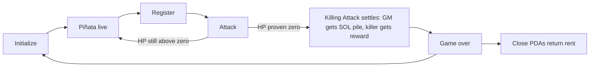

# Game

Smash a piñata you cannot size. Several can be live at once; each is independent.

## Roles

- **Game master** — initializes a piñata, locks HP and reward, receives the SOL pile at game-over
- **Player** — registers, pays SOL to attack, may win the confidential token reward

## Rules

- Each **Attack** deals **1 HP**
- Strike SOL goes into **that piñata’s pile** — not the player prize
- The prize is the **hidden token reward**
- On the killing blow: game master gets the SOL pile; killer gets the reward
- After a kill: **Close** (rent back) or **Initialize** again (new session, same piñata)

## Session loop

## Why the hidden amounts matter

Every strike is a bet against unknown remaining HP and unknown token pot. The public SOL pile grows with each strike (visible strike count). HP and reward size stay encrypted.
