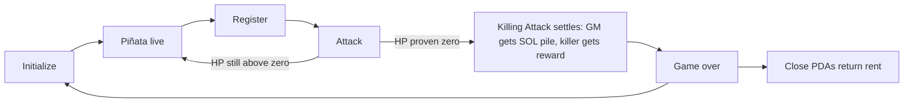

# Game

Smash a piñata you cannot size. Several can be live at once; each is independent.

## Roles

- **Game master** — the house. Initializes a piñata, locks HP and reward, receives the SOL pile at game-over. Knows HP and reward because they chose them. v1 confidential keys for live play sit on their **relay**, not in a manual per-strike workflow.
- **Player** — registers, pays SOL to attack, may win the confidential token reward. Does not know remaining HP or reward size.
- **Identity** — every participant presents a SAS attestation whose person id is unique. The GM cannot Attack this piñata (same person id). A second wallet with a second attestation for the same person is an issuer failure.

## Rules

- Each **Attack** deals **1 HP**
- A registered player may Attack **without a cap** while the piñata is live
- Strike SOL goes into **that piñata’s pile** — not the player prize
- The prize is the **hidden token reward**
- On the killing blow: game master gets the SOL pile; killer gets the reward
- The game master’s **person id** cannot Attack. v1 still lets the house **withhold proofs** and pick who strikes (accepted). Proofs come from a **GM-hosted relay** (automation, not a different trust party). Later, an independent arbiter is supposed to remove dealer discretion.
- After a kill: **Close** (rent back) or **Initialize** again (new session, same piñata)

## Session loop

## Why the hidden amounts matter

Every strike is a bet against unknown remaining HP and unknown token pot — unknown to **players and spectators**. The public SOL pile grows with each strike (visible strike count). HP and reward size stay encrypted from that audience.

The game master does not need auditor keys to know remaining HP: they set initial HP, and remaining is `initial −` strike count. Auditor keys would only matter for a **third-party** decryptor.

At game-over, strike count equals initial HP, so initial HP becomes public. Remaining HP during play stays hidden from anyone who did not know the initial amount.

Players judge a game master by **session history** (SAS person id is stable). That is the reason to strike, not a guaranteed fair pot. **HP history is public** (strike count at game-over). **Reward amount stays hidden after the win** — killer and GM know it; spectators do not. Reward-quality reputation is off-chain rumor.
