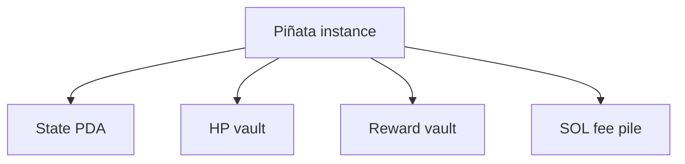
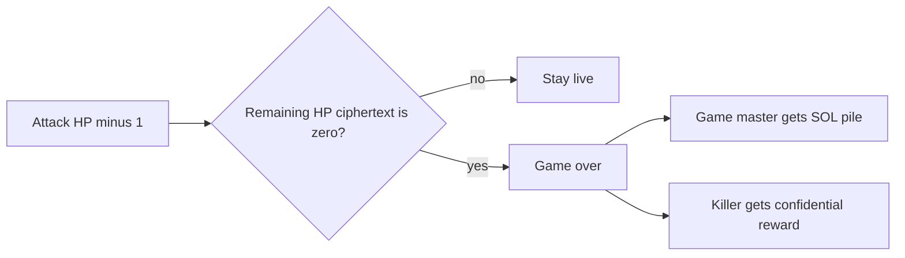
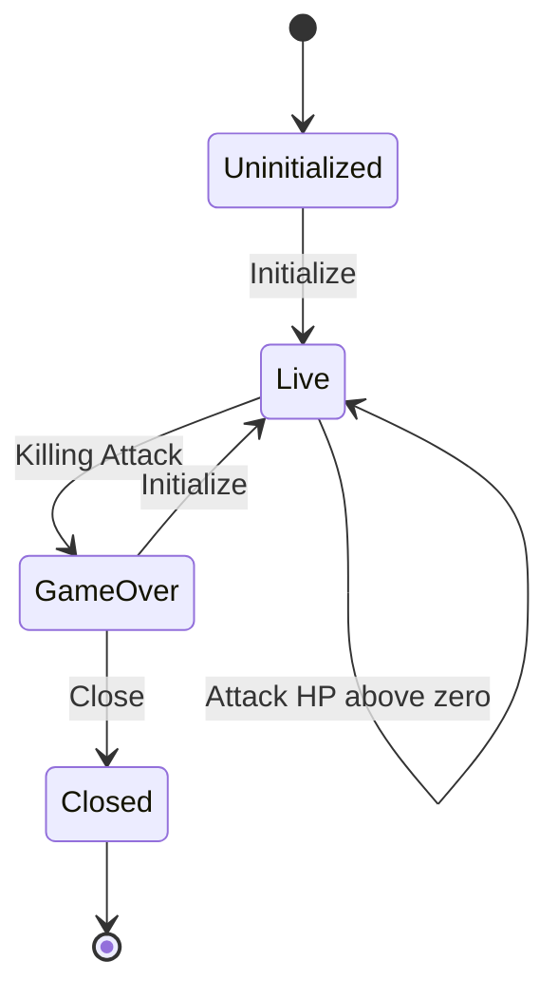

# Program

Rules engine over confidential HP and reward. **Many instances:** each piñata is its own PDA set. Instructions always target one piñata.

## Per-piñata accounts

## Instructions

- **Initialize** — game master locks HP amount and confidential reward for this piñata. Also starts a **new session** after game-over. Not valid while live.
- **Register** — admit a player; set up their reward token account. Only while live.
- **Attack** — pay fixed SOL into this piñata’s pile; HP − 1; evaluate live vs kill. Only while live.
- **Close** — tear down this piñata’s PDAs; return rent SOL. Only after game-over.

## Killing Attack

When remaining HP is proven zero (ElGamal proof program), the same **Attack** enters game-over and settles atomically:

## Lifecycle

After game-over, only **Close** or **Initialize**. No instruction data schemas in this conceptual pass.
