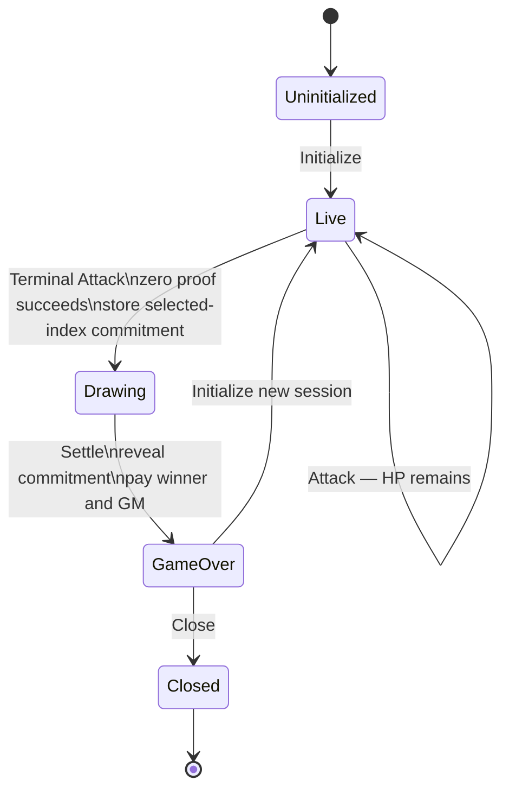
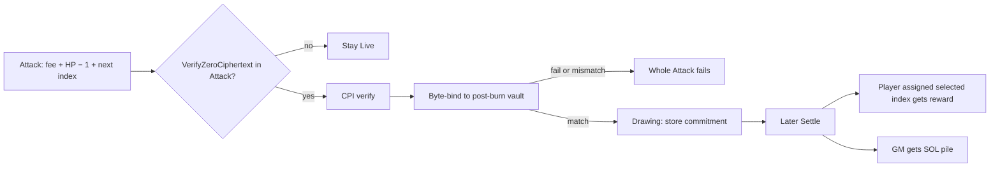

# Program

On-chain rules over confidential HP, raffle lifecycle, and a public reward. Off-chain arbiter: [arbiter.md](arbiter.md). Layout: [deployment.md](deployment.md).

Many instances: each piñata is its own PDA set; they share one HP mint (**DEP6**). Every instruction targets **one** piñata.

Instruction data schemas and account byte layouts are out of scope here.

While `Drawing`, only **Settle** is valid. After `GameOver`, only **Close** or **Initialize** is valid.

## Instructions

| Instruction | When | What |
| --- | --- | --- |
| **Initialize** | `Uninitialized` or `GameOver`; never `Live` or `Drawing`. | GM pays PDA rent, locks a **public** reward, sets the strike fee. Arbiter prices and sets HP. Initialize CPIs `ConfidentialMint` into this vault on the **shared** mint, then immediately CPIs `ApplyPendingBalance`; both use the arbiter's transaction signer privilege and no PDA signer. Resets the successful-Attack count for a new session. |
| **Register** | `Live` only. | Admit a player and set up their reward token account. |
| **Attack** | `Live` only. | Atomically move the fixed strike fee into this pile, burn 1 HP, assign the next zero-based successful-Attack index to the attacker, and increment the successful-Attack count. A terminal zero proof transitions to `Drawing` and stores a selected-index commitment. Attack never transfers the reward or pile. |
| **Settle** | `Drawing` only. | Arbiter-signed commitment opening. Validate the selected index, then atomically transfer the public reward to the player assigned that index and the SOL pile to the GM; enter `GameOver`. The requester is fee payer (**F3**). |
| **Close** | `GameOver` only. GM signer and rent recipient. | Tear down this instance's PDAs (including this HP token account). MUST NOT close the shared HP mint. Arbiter attaches leftover-zero proof and signs as vault authority; GM completes (**F0**). **Not** settlement. |

## Attack closure and settlement

`ConfidentialBurn` does not tell the program that post-burn HP is zero. Homomorphic leftover-zero is not identity ciphertext. The program MUST NOT `memcmp` zeros and MUST NOT decrypt remaining HP.

| Branch | Program MUST |
| --- | --- |
| Proof **absent** | Keep the instance `Live`. Do not pay pile or reward. Required even if post-burn HP is actually zero. A conforming arbiter MUST NOT submit that terminal burn (**A5**). The instruction is theoretically open because v1 does not require a leftover-nonzero proof; that path is malicious/exploited arbiter only (**A7**), which v1 accepts. |
| Proof **present** | CPI the proof program. Failed CPI MUST fail the **whole** Attack, including fee, burn, index assignment, and count change. After success, context ElGamal pubkey MUST equal the vault's ElGamal pubkey and context ciphertext MUST equal the post-burn `available_balance`. Mismatch MUST fail. Match MUST store the supplied selected-index commitment and enter `Drawing`; it MUST NOT transfer reward or pile. |

The proof is for the **post-burn** vault blob (homomorphic leftover), not a freshly encrypted zero. `Settle` relies on the on-chain `Drawing` state and MUST NOT verify the same zero proof again.

The chronological successful-Attack history defines which wallet was assigned each index. In the prototype, the arbiter scans that public history and supplies the reward account for the player assigned the selected index; the program does not scan historical transactions. Whether launch must enforce the VRF-selected index-to-attacker mapping on-chain is still open (**A8**, [arbiter.md](arbiter.md) **O2**).

## Decided

Normative language follows RFC 2119. These decisions apply to the on-chain program. Arbiter behavior is [arbiter.md](arbiter.md).

### D1. Surface and instances

The program MUST expose exactly five instructions: **Initialize**, **Register**, **Attack**, **Settle**, and **Close**. Each piñata is an independent instance with its own PDA set (**DEP1**). Every instruction MUST target one instance. All instances MUST use the same HP mint (**DEP6**).

The lifecycle MUST be `Uninitialized → Live → Drawing → GameOver`, with the transitions shown above. While `Drawing`, Attack, Register, Initialize, and Close MUST fail; only Settle is permitted.

> **FUTURE (not v1).** v1 lets the arbiter modify HP out of band (Token-2022 signed by mint/vault authority, including sibling instructions and transactions that never invoke this program) to reduce the number of Piñata program instructions during early development. **D3** still requires Attack's burn to be a CPI when Attack runs; that does not stop Token-2022 from accepting a burn with no Attack. Later versions MUST restrict HP modifications to the Piñata program and MUST forbid that out-of-band path ([deployment.md](deployment.md) **DEP6**, **O1**).

### D2. Hit points at Initialize

The game master MUST NOT choose HP. HP at Initialize MUST be set by the arbiter using **A3**. Initial HP determines how many successful strikes close play and therefore the hidden length of the Drawing range. Public deposit amounts and public mint supply MUST NOT reveal it. Initialize MUST CPI `ConfidentialMint` and then immediately CPI `ApplyPendingBalance`, making the pending HP available atomically before Initialize succeeds. Initialize MUST reset the session's successful-Attack count to zero.

### D3. Attack, terminal transition, and Settle

Every successful Attack MUST atomically debit one HP (`ConfidentialBurn`), credit the instance SOL pile by the fixed strike fee, assign the attacker's wallet the next zero-based chronological successful-Attack index, and increment the count. Failed transactions MUST assign no index and do none of those things. The burn MUST be a CPI from Attack so the strike, index assignment, and fee stay one instruction. The Token-2022 vault-authority signer MUST be the arbiter, not a PDA (**DEP6**).

The on-chain live-versus-terminal branch MUST be whether this Attack includes a ZK ElGamal Proof Program `VerifyZeroCiphertext` proof. The program MUST verify a present proof by CPI and byte-bind it to the post-burn HP vault. A failed or mismatched proof MUST fail the whole Attack. A proof absent from the terminal burn leaves the instance stalled `Live` with encrypt(0), the accepted malicious/exploited-arbiter caveat (**A7**).

When the bound zero proof succeeds, the Terminal Attack MUST retain its assigned index, record final successful-Attack count `N`, require and store a hiding and binding selected-index commitment supplied by the arbiter, and transition `Live → Drawing`. The final Drawing range is `[0, N - 1]`, including the Terminal Attack's index. The commitment MUST bind the session, `N`, selected index, and a secret nonce. Attack MUST NOT transfer the reward or SOL pile.

Settle MUST:

1. Target the correct instance and require state `Drawing`.
2. Require the configured arbiter authority's signature.
3. Reveal the committed selected index and nonce, recompute the commitment over the session, final `N`, index, and nonce, and reject an invalid opening.
4. Reject an index outside `[0, N - 1]` (equivalently, the index MUST be below the final successful-Attack count).
5. Use the reward recipient supplied from the chronological successful-Attack history for the player assigned that index. The prototype trusts the arbiter's off-chain mapping; the program MUST NOT claim to scan historical transactions.
6. Atomically pay the entire public reward to the player assigned the selected index and the entire SOL pile to the GM, then enter `GameOver`.
7. Reject if settlement has already occurred. The `Drawing → GameOver` state guard MUST make a second execution impossible.

Exact commitment bytes, hash, field sizes, and account layout remain instruction-layout details. The reward transfer is public; no confidential reward proof is involved.

v1 MUST NOT require a leftover-HP-nonzero proof on the live path. The proof program documents `VerifyZeroCiphertext` and range proofs on `[0, 2ⁿ)` (zero included), not a leftover-exclusive-of-zero instruction. Composing a shifted range to exclude 0 is out of scope (**A7**).

### D4. Close and session reuse

A new session on the same piñata MUST start only from `GameOver`, never from `Drawing`. Close MUST be callable only by the game master, valid only from `GameOver`, and return rent to the game master. Close MUST be assembled by the arbiter (**DEP4**); the GM MUST NOT be assumed to hold vault ElGamal keys or HP vault authority. Close MUST close this instance's HP token account and MUST NOT close the shared HP mint (**DEP6**). Close MUST NOT pay the SOL pile or reward; `Settle` already moved both (**D3**).

## Still open

- Exact instruction data schemas, commitment hash/encoding, field sizes, account metas, and account byte layouts.
- Pre-launch VRF request/reveal fields and transaction lifecycle, including any program changes, are [arbiter.md](arbiter.md) **O2**.
