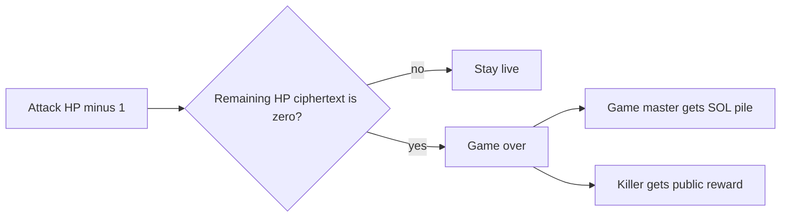
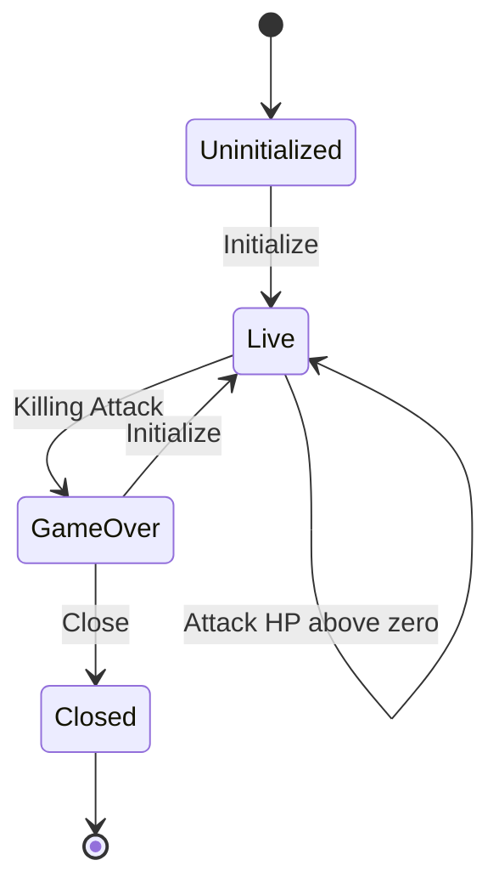

# Program

Rules engine over confidential HP and a public reward. **Many instances:** each piñata is its own PDA set ([deployment.md](deployment.md)). Instructions always target one piñata. The off-chain relay is specified in [arbiter.md](arbiter.md).

## Instructions

- **Initialize** — game master pays rent for this session’s PDAs, locks a **public** reward, and sets the strike fee. The **arbiter** ([arbiter.md](arbiter.md)) prices the reward, sets HP, and confidential-mints it. Also starts a **new session** after game-over. Not valid while live.
- **Register** — admit a player; set up their reward token account. Only while live.
- **Attack** — pay fixed SOL into this piñata’s pile; HP − 1; evaluate live vs kill. Only while live. Not player-only: the arbiter attaches confidential HP proofs. On a kill, the same instruction pays the public reward (no confidential reward proofs).
- **Close** — **GM only.** Tear down this piñata’s PDAs; rent SOL returns to the GM (they paid it at Initialize). Only after game-over.

## Killing Attack

When remaining HP is proven zero (ElGamal proof program), the same **Attack** enters game-over and settles atomically. The arbiter produces the HP proofs; the reward moves as a normal public transfer (the amount was already visible).

## Lifecycle

After game-over, only **Close** or **Initialize**. No instruction data schemas in this conceptual pass.

## Decided

Normative language follows RFC 2119. These decisions apply to the on-chain program. Arbiter behavior is specified in [arbiter.md](arbiter.md). Instruction layouts and account byte schemas are out of scope here.

### D1. Surface and instances

The program MUST expose exactly four instructions: **Initialize**, **Register**, **Attack**, and **Close**. Each piñata is an independent instance with its own PDA set ([deployment.md](deployment.md) **DEP1**). Every instruction MUST target one instance.

### D2. Hit points at Initialize

The game master MUST NOT choose HP. HP at Initialize MUST be set by the arbiter as specified in [arbiter.md](arbiter.md) **A3**. Public deposit amounts and public mint supply MUST NOT reveal HP.

### D3. Attack and kill settlement

Attack MUST debit one HP and credit the instance SOL pile by the fixed strike fee. When remaining HP is proven zero (ElGamal proof program), the same Attack MUST enter game-over and MUST settle atomically: the game master receives the SOL pile; the attacker receives the public reward. The arbiter MUST attach confidential HP proofs ([arbiter.md](arbiter.md) **A5**). The reward transfer MUST be a public token transfer (no confidential reward proofs).

### D4. Close and session reuse

After game-over, the only valid instructions are **Close** and **Initialize** (new session on the same piñata). Close MUST be callable only by the game master. Rent MUST return to the game master (they paid it at Initialize). Close MUST be valid only after game-over.
