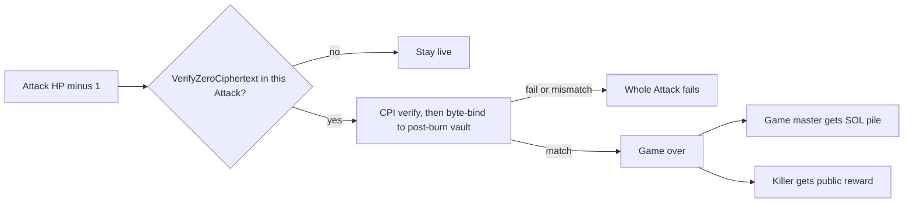
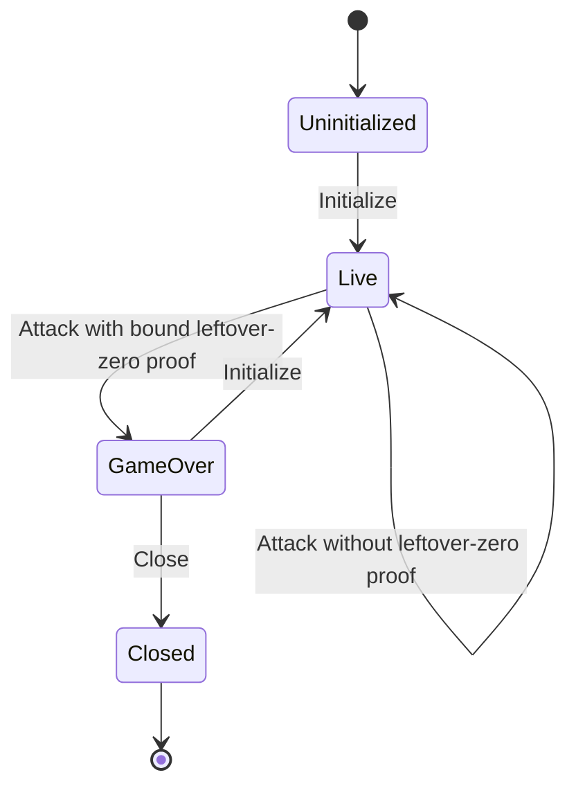

# Program

Rules engine over confidential HP and a public reward. **Many instances:** each piñata is its own PDA set ([deployment.md](deployment.md)). Instructions always target one piñata. The off-chain arbiter webapp is specified in [arbiter.md](arbiter.md).

## Instructions

- **Initialize** — game master pays rent for this session’s PDAs, locks a **public** reward, and sets the strike fee. The **arbiter** ([arbiter.md](arbiter.md)) prices the reward, sets HP, and confidential-mints it. `ConfidentialMint` is a CPI during Initialize; `ApplyPendingBalance` follows immediately so minted HP is available. Also starts a **new session** after game-over. Not valid while live.
- **Register** — admit a player; set up their reward token account. Only while live.
- **Attack** — pay fixed SOL into this piñata’s pile; HP − 1; evaluate live vs kill. Only while live. Not player-only: assembled by the arbiter webapp’s program client ([deployment.md](deployment.md) **DEP4**); the arbiter attaches confidential HP proofs. Live versus kill is whether this Attack includes a bound `VerifyZeroCiphertext` proof (**D3**), not whether leftover HP is actually zero. On a kill, the same instruction pays the public reward (no confidential reward proofs).
- **Close** — **GM only.** Tear down this piñata’s PDAs; rent SOL returns to the GM (they paid it at Initialize). Only after game-over.

## Killing Attack

`ConfidentialBurn` does not tell the program leftover HP is zero. The live-versus-kill branch is whether this Attack includes a `VerifyZeroCiphertext` proof. The proof program attests that a ciphertext encrypts zero; the Piñata program MUST bind that ciphertext to this vault after the burn (**D3**). On a match, the same Attack enters game-over and settles atomically. The reward moves as a normal public transfer (the amount was already visible).

## Lifecycle

After game-over, only **Close** or **Initialize**. No instruction data schemas in this conceptual pass.

## Decided

Normative language follows RFC 2119. These decisions apply to the on-chain program. Arbiter behavior is specified in [arbiter.md](arbiter.md). Instruction layouts and account byte schemas are out of scope here.

### D1. Surface and instances

The program MUST expose exactly four instructions: **Initialize**, **Register**, **Attack**, and **Close**. Each piñata is an independent instance with its own PDA set ([deployment.md](deployment.md) **DEP1**). Every instruction MUST target one instance.

### D2. Hit points at Initialize

The game master MUST NOT choose HP. HP at Initialize MUST be set by the arbiter as specified in [arbiter.md](arbiter.md) **A3**. Public deposit amounts and public mint supply MUST NOT reveal HP.

### D3. Attack and kill settlement

Attack MUST debit one HP (`ConfidentialBurn`) and credit the instance SOL pile by the fixed strike fee. Token-2022 `ConfidentialBurn` succeeds whether leftover HP is zero or not. Homomorphic leftover-zero is not an identity ciphertext. The program MUST NOT treat a vault `memcmp` of zeros as a kill check and MUST NOT decrypt remaining HP.

The on-chain live-versus-kill branch MUST be whether this Attack includes a ZK ElGamal Proof Program `VerifyZeroCiphertext` proof, not whether leftover HP is actually zero. The program MUST CPI that program to verify the proof when it is present. A failed CPI MUST fail the whole Attack (burn included). The runtime does not allow “try the zero-proof and fall through to live.”

- **Proof absent.** The instance MUST stay live. The program MUST NOT pay the SOL pile or the reward. This remains required even if leftover HP is actually zero. That omit path is arbiter censorship ([arbiter.md](arbiter.md) **A7**), not a missing leftover-nonzero check.
- **Proof present.** After a successful CPI, the program MUST byte-compare the proof context to the HP vault **after** the burn: context ElGamal pubkey MUST equal the vault’s ElGamal pubkey; context ciphertext MUST equal the vault’s `available_balance`. Mismatch MUST fail the Attack (an isolated `Encrypt(0)` is not this vault). Match MUST enter game-over on the same Attack and MUST settle atomically: the game master receives the SOL pile; the attacker receives the public reward.

The arbiter MUST attach confidential HP proofs as specified in [arbiter.md](arbiter.md) **A5**. The reward transfer MUST be a public token transfer (no confidential reward proofs).

v1 MUST NOT require a leftover-HP-nonzero proof on the live path. The proof program documents `VerifyZeroCiphertext` and range proofs on `[0, 2ⁿ)` (zero included). It does not document a leftover-exclusive-of-zero / nonzero instruction. Composing a shifted range to exclude 0 is out of scope (**A7**).

### D4. Close and session reuse

After game-over, the only valid instructions are **Close** and **Initialize** (new session on the same piñata). Close MUST be callable only by the game master. Rent MUST return to the game master (they paid it at Initialize). Close MUST be valid only after game-over.
