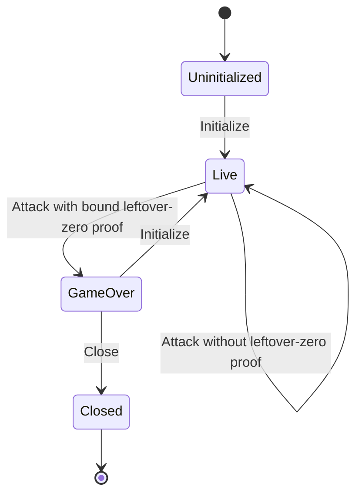
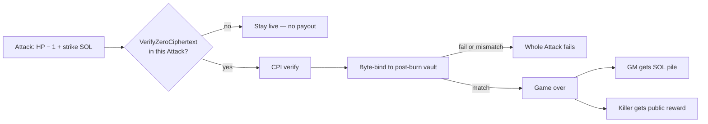

# Program

On-chain rules over confidential HP and a public reward. Off-chain arbiter: [arbiter.md](arbiter.md). Layout: [deployment.md](deployment.md).

Many instances: each piñata is its own PDA set; they share one HP mint (**DEP6**). Every instruction targets **one** piñata.

Instruction data schemas and account byte layouts are out of scope here.

After game-over, only **Close** or **Initialize**.

## Instructions

| Instruction | When | What |
| --- | --- | --- |
| **Initialize** | Not while live. Also starts a new session after game-over. | GM pays PDA rent, locks a **public** reward, sets the strike fee. Arbiter prices, sets HP, confidential-mints into this vault on the **shared** mint. `ConfidentialMint` CPI; `ApplyPendingBalance` immediately after (arbiter vault authority, no PDA signer). |
| **Register** | Live only | Admit a player; set up their reward token account. |
| **Attack** | Live only | Strike fee into this pile; HP − 1; live vs kill. Not player-only: arbiter assembles, attaches proofs, signs as vault authority on the `ConfidentialBurn` CPI. Kill pays the public reward on the **same** instruction (no confidential reward proofs). |
| **Close** | After game-over only. GM signer and rent recipient. | Tear down this instance’s PDAs (including this HP token account). MUST NOT close the shared HP mint. Arbiter attaches leftover-zero proof and signs as vault authority; GM completes (**F0**). **Not** settlement (pile and reward already moved on the killing Attack). |

## Kill settlement

`ConfidentialBurn` does not tell the program leftover HP is zero. Homomorphic leftover-zero is not identity ciphertext. The program MUST NOT `memcmp` zeros and MUST NOT decrypt remaining HP.

Live vs kill = whether **this Attack** includes `VerifyZeroCiphertext`, not whether leftover is actually zero.

| Branch | Program MUST |
| --- | --- |
| Proof **absent** | Stay live. Do not pay pile or reward. Required even if leftover HP is actually zero. Conforming arbiter MUST NOT submit that Attack (**A5**). The instruction is theoretically open because v1 does not require leftover-nonzero; that path is malicious/exploited arbiter only (**A7**), which v1 accepts. |
| Proof **present** | CPI the proof program. Failed CPI MUST fail the **whole** Attack (burn included). Runtime does not allow “try the zero-proof and fall through to live.” After success: context ElGamal pubkey MUST equal the vault’s ElGamal pubkey; context ciphertext MUST equal post-burn `available_balance`. Mismatch MUST fail (an isolated `Encrypt(0)` is not this vault). Match MUST enter game-over and settle **atomically** on the same Attack. |

The proof is for the **post-burn** vault blob (homomorphic leftover), not a freshly encrypted zero.

## Decided

Normative language follows RFC 2119. These decisions apply to the on-chain program. Arbiter behavior is [arbiter.md](arbiter.md).

### D1. Surface and instances

The program MUST expose exactly four instructions: **Initialize**, **Register**, **Attack**, and **Close**. Each piñata is an independent instance with its own PDA set (**DEP1**). Every instruction MUST target one instance. All instances MUST use the same HP mint (**DEP6**).

### D2. Hit points at Initialize

The game master MUST NOT choose HP. HP at Initialize MUST be set by the arbiter (**A3**). Public deposit amounts and public mint supply MUST NOT reveal HP.

### D3. Attack and kill settlement

Attack MUST debit one HP (`ConfidentialBurn`) and credit the instance SOL pile by the fixed strike fee. That burn MUST be a CPI from Attack so the hit and the fee stay one instruction. The Token-2022 vault-authority signer on that CPI MUST be the arbiter, not a PDA (**DEP6**). Token-2022 `ConfidentialBurn` succeeds whether leftover HP is zero or not. Homomorphic leftover-zero is not an identity ciphertext. The program MUST NOT treat a vault `memcmp` of zeros as a kill check and MUST NOT decrypt remaining HP.

The on-chain live-versus-kill branch MUST be whether this Attack includes a ZK ElGamal Proof Program `VerifyZeroCiphertext` proof, not whether leftover HP is actually zero. The program MUST CPI that program to verify the proof when it is present. A failed CPI MUST fail the whole Attack (burn included). The runtime does not allow “try the zero-proof and fall through to live.”

- **Proof absent.** The instance MUST stay live. The program MUST NOT pay the SOL pile or the reward. This remains required even if leftover HP is actually zero. A conforming arbiter MUST NOT submit that Attack (**A5**). The instruction is still theoretically vulnerable because v1 does not require a leftover-nonzero proof; that path is only a malicious or exploited arbiter (**A7**), which v1 accepts.
- **Proof present.** After a successful CPI, the program MUST byte-compare the proof context to the HP vault **after** the burn: context ElGamal pubkey MUST equal the vault’s ElGamal pubkey; context ciphertext MUST equal the vault’s `available_balance`. Mismatch MUST fail the Attack (an isolated `Encrypt(0)` is not this vault). Match MUST enter game-over on the same Attack and MUST settle atomically: the game master receives the SOL pile; the attacker receives the public reward.

The arbiter MUST attach confidential HP proofs as specified in **A5**. The reward transfer MUST be a public token transfer (no confidential reward proofs).

v1 MUST NOT require a leftover-HP-nonzero proof on the live path. The proof program documents `VerifyZeroCiphertext` and range proofs on `[0, 2ⁿ)` (zero included). It does not document a leftover-exclusive-of-zero / nonzero instruction. Composing a shifted range to exclude 0 is out of scope (**A7**).

### D4. Close and session reuse

After game-over, the only valid instructions are **Close** and **Initialize** (new session on the same piñata). Close MUST be callable only by the game master. Rent MUST return to the game master (they paid it at Initialize). Close MUST be valid only after game-over. Close MUST be assembled by the arbiter (**DEP4**); the GM MUST NOT be assumed to hold vault ElGamal keys or the HP vault authority. Close MUST close this instance’s HP token account and MUST NOT close the shared HP mint (**DEP6**). Close MUST NOT pay the SOL pile or the reward (settlement is Attack-only, **D3**).
